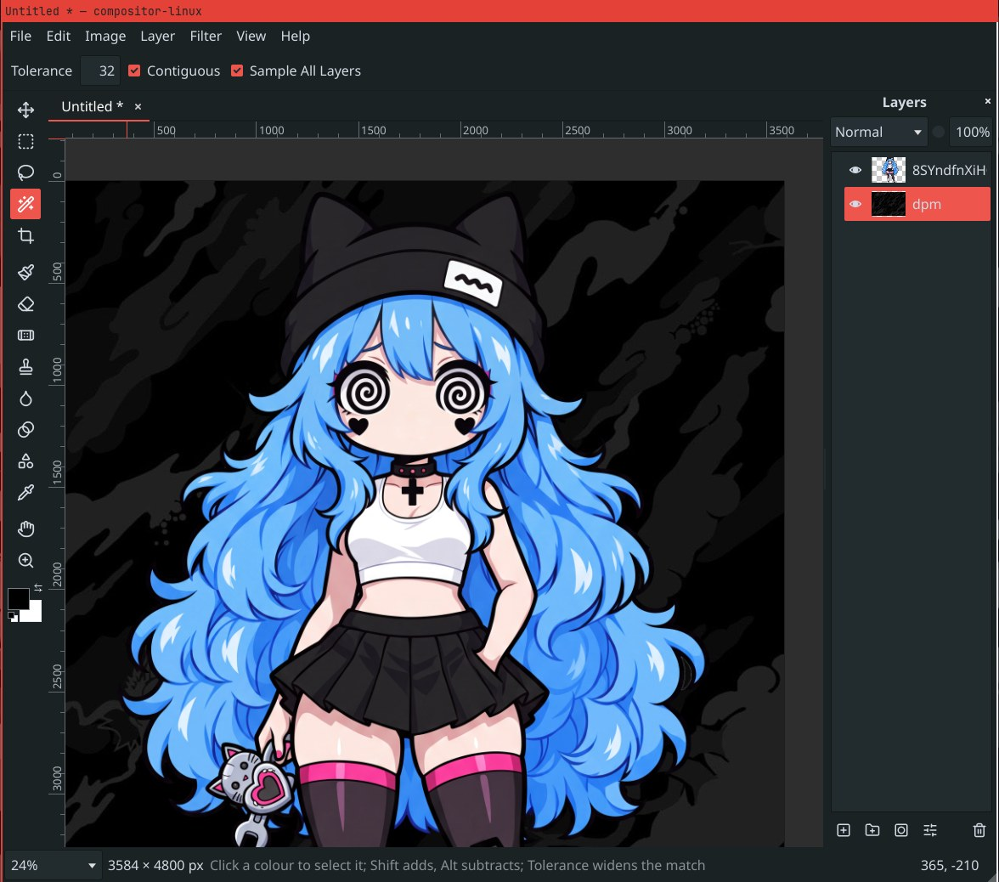

<p align="center">
  
</p>

# compositor-linux

**English** · [日本語](#日本語)

A fast, focused image editor for Linux: layers, masks, selections, brushes,
adjustments and filters, with the tools and shortcuts you know from Photoshop.
It is a native port of [Compositor](https://github.com/robbietilton/Compositor)
for macOS, and opens Photoshop files and the Mac app's `.comp` projects.

<p align="center">
  
</p>

## What it does

- **Layers:** folders, blend modes, opacity, layer masks, clipping masks and adjustment layers
- **Transform:** move, scale, rotate and distort without losing resolution
- **Selections:** marquee, lasso, magic wand, and Quick Select by scribble or by click; Content-Aware Fill
- **Painting:** brush, eraser, spot healing, clone stamp, smudge, liquify, gradients, shapes and text
- **Brushes:** 196 MyPaint brushes (pencils, inks, charcoal, paint, smudging) that follow pen pressure and tilt
- **Adjustments and filters:** levels, curves, hue/saturation, exposure, gradient map, grain, blurs, noise and lens correction
- **Remove Background:** an AI model that runs on your own machine; nothing is uploaded
- **G'MIC:** over 700 more filters with a live preview, when `gmic` is installed
- **Files:** Photoshop PSD and PSB with layers, folders, masks and blend modes; projects of up to a gigapixel of layers; PNG and JPEG export; several projects in tabs
- **AI agents:** Claude Code or any MCP client can drive the editor

The full list is in [docs/features.md](docs/features.md).

## Performance

The heavy work runs on every core. Times on a 12-core laptop (AMD Ryzen AI 9 HX 370):

| Task | Time |
|---|---|
| Open a 70 MB Photoshop file (17 layers at 4096 × 4096) | 0.7 s |
| Save it as a project | 1.3 s |
| Save a project with five 4096 × 4096 layers | 0.7 s (7.2 s in 0.6.0) |
| Open that project | 0.4 s (2.5 s in 0.6.0) |
| Export a 4096 × 4096 PNG | 0.24 s (1.8 s in 0.6.0) |
| Quick Select, per stroke | 0.16 s on average (0.65 s in 0.6.0) |
| Remove Background on a 10-megapixel photo | 1.7 s (8.3 s with every refinement on) |
| Gaussian blur on a 12-megapixel layer | under 0.1 s |

## Get it

Download the AppImage from the [Releases](../../releases) page, make it
executable, and run it. It works on any x86_64 Linux from 2022 on, under
Wayland or X11.

```bash
chmod +x compositor-linux-*.AppImage
./compositor-linux-*.AppImage
```

To add it to your app launcher, open `.comp` projects by double-click and
offer it for `.psd` files, run the integration script once (no root needed;
`--remove` undoes it):

```bash
curl -fsSL https://raw.githubusercontent.com/vomitselfie/compositor-linux/main/tools/integrate-appimage.sh | bash -s -- compositor-linux-*.AppImage
```

**On a Mac:** each release also has an unsigned app bundle for Apple
Silicon. Unzip it, move it to Applications, and open it with right-click >
Open the first time.

**Remove Background** is off until you turn it on in Edit > Preferences,
which downloads the model once.

## Use it with an AI agent

```bash
claude mcp add compositor -- uv run /path/to/compositor-linux/mcp/compositor_mcp.py
```

Then ask for something like "open photo.jpg, remove the background, put a
dark gradient behind it and export result.png". See
[docs/automation.md](docs/automation.md).

## Build from source

```bash
# Arch / Manjaro
sudo pacman -S cmake ninja qt6-base qt6-svg qt6-wayland qt6-imageformats libpng libmypaint opencv
# Ubuntu 24.04
sudo apt install cmake ninja-build qt6-base-dev qt6-svg-dev qt6-wayland qt6-image-formats-plugins libpng-dev libmypaint-dev libgl1-mesa-dev libopencv-dev

cmake -S . -B build -G Ninja -DCMAKE_BUILD_TYPE=Release
cmake --build build -j
./build/src/app/compositor-linux
```

macOS, build options, command-line flags and keyboard shortcuts are in
[docs/linux-port.md](docs/linux-port.md).

## License

GPL-3.0-or-later; see [LICENSE](LICENSE). Based on Compositor by Wonder
Assembly LLC, whose code keeps its MIT licence
([LICENSES/MIT-Compositor.txt](LICENSES/MIT-Compositor.txt)). Third-party
components and their licences are listed in
[THIRD-PARTY-NOTICES.md](THIRD-PARTY-NOTICES.md).

---

## 日本語

[English](#compositor-linux) · **日本語**

Linux 向けの軽快でシンプルな画像編集ソフトです。レイヤー、マスク、選択範囲、ブラシ、
色調補正、フィルターを備え、Photoshop でおなじみのツールとショートカットで操作できます。
macOS 版 [Compositor](https://github.com/robbietilton/Compositor) のネイティブ移植で、
Photoshop ファイルと Mac 版の `.comp` プロジェクトを開けます。

### できること

- **レイヤー:** フォルダー、描画モード、不透明度、レイヤーマスク、クリッピングマスク、調整レイヤー
- **変形:** 解像度を落とさずに移動・拡大縮小・回転・自由変形
- **選択範囲:** 長方形・楕円選択、なげなわ、自動選択、なぞる/クリックするだけのクイック選択、コンテンツに応じた塗りつぶし
- **描画:** ブラシ、消しゴム、スポット修復ブラシ、コピースタンプ、指先ツール、ゆがみ、グラデーション、シェイプ、テキスト
- **ブラシ:** 筆圧と傾きに反応する MyPaint ブラシ 196 種類(鉛筆、インク、木炭、絵の具、ぼかし)
- **色調補正とフィルター:** レベル補正、トーンカーブ、色相・彩度、露光量、グラデーションマップ、粒子、ぼかし、ノイズ、レンズ補正
- **背景を削除:** AI モデルは手元のマシンで動作し、画像はどこにも送信されません
- **G'MIC:** `gmic` をインストールすると、700 種類以上のフィルターをライブプレビュー付きで使えます
- **ファイル:** レイヤー・フォルダー・マスク・描画モードを保ったまま PSD/PSB を開けます。1 ギガピクセルまでのプロジェクト、PNG/JPEG 書き出し、タブで複数のプロジェクト
- **AI エージェント:** Claude Code などの MCP クライアントから操作できます

機能の一覧は [docs/features.md](docs/features.md#日本語) にあります。

### パフォーマンス

重い処理はすべての CPU コアで並列に実行します。12 コアのノート PC(AMD Ryzen AI 9 HX 370)での計測値:

| 処理 | 時間 |
|---|---|
| 70 MB の Photoshop ファイルを開く(4096 × 4096 のレイヤー 17 枚) | 0.7 秒 |
| それをプロジェクトとして保存 | 1.3 秒 |
| 4096 × 4096 のレイヤー 5 枚のプロジェクトを保存 | 0.7 秒(0.6.0 では 7.2 秒) |
| そのプロジェクトを開く | 0.4 秒(0.6.0 では 2.5 秒) |
| 4096 × 4096 の PNG を書き出し | 0.24 秒(0.6.0 では 1.8 秒) |
| クイック選択(1 ストロークあたり) | 平均 0.16 秒(0.6.0 では 0.65 秒) |
| 1000 万画素の写真の背景を削除 | 1.7 秒(すべての補正をオンにして 8.3 秒) |
| 1200 万画素のレイヤーにぼかし(ガウス) | 0.1 秒未満 |

### 入手方法

[Releases](../../releases) ページから AppImage をダウンロードし、実行権限を付けて起動します。
2022 年以降の x86_64 Linux であれば、Wayland と X11 のどちらでも動作します。

```bash
chmod +x compositor-linux-*.AppImage
./compositor-linux-*.AppImage
```

アプリランチャーに登録し、`.comp` をダブルクリックで開けるようにして `.psd` の「別のアプリで開く」にも
表示させるには、統合スクリプトを一度実行します(root 権限は不要、`--remove` で元に戻せます):

```bash
curl -fsSL https://raw.githubusercontent.com/vomitselfie/compositor-linux/main/tools/integrate-appimage.sh | bash -s -- compositor-linux-*.AppImage
```

**Mac の場合:** 各リリースには Apple シリコン向けの未署名アプリも含まれます。
展開して「アプリケーション」に移動し、初回だけ右クリック >「開く」で起動してください。

**背景を削除** は、編集 > 環境設定 でオンにすると使えるようになります(モデルを一度だけダウンロードします)。

### AI エージェントから使う

```bash
claude mcp add compositor -- uv run /path/to/compositor-linux/mcp/compositor_mcp.py
```

あとは「photo.jpg を開いて背景を削除し、後ろに暗いグラデーションを敷いて result.png に書き出して」
のように頼むだけです。詳しくは [docs/automation.md](docs/automation.md)(英語)をご覧ください。

### ソースからビルド

必要なパッケージとビルド手順は、英語版の [Build from source](#build-from-source) と同じです。
macOS でのビルド、オプション、キーボードショートカットは [docs/linux-port.md](docs/linux-port.md)(英語)にあります。

### ライセンス

GPL-3.0-or-later です([LICENSE](LICENSE))。Wonder Assembly LLC の Compositor を元にしており、
その部分のコードは MIT ライセンスのままです([LICENSES/MIT-Compositor.txt](LICENSES/MIT-Compositor.txt))。
サードパーティー製コンポーネントとそのライセンスは [THIRD-PARTY-NOTICES.md](THIRD-PARTY-NOTICES.md) にまとめています。
