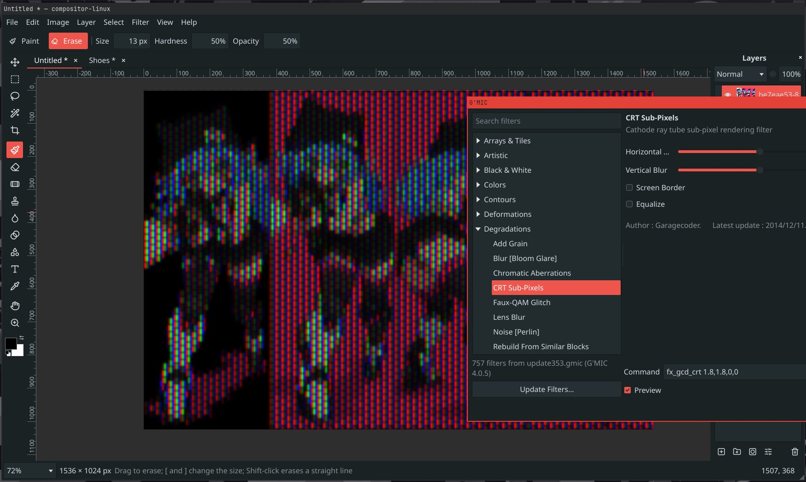

<p align="center">
  
</p>

# compositor-linux

A small, focused image editor for Linux: layers, masks, selections, brushes,
adjustments and filters, with Photoshop-style tools and shortcuts and none of
the bloat. It is a native port of [Compositor](https://github.com/robbietilton/Compositor)
for macOS and opens the same `.comp` projects.

<p align="center">
  
</p>

<p align="center">
   G'MIC: the catalogue's folders on the left, a CRT sub-pixel filter's controls on the right, and its live preview on the canvas" width="800">
  <br>
  <sub>Filter &gt; G'MIC: over 700 filters with their own controls and a live preview.</sub>
</p>

## Get it

Download the AppImage from the [Releases](../../releases) page, make it
executable, and run it:

```bash
chmod +x compositor-linux-*.AppImage
./compositor-linux-*.AppImage
```

It runs on any x86_64 Linux from 2022 on, under Wayland or X11. Open an image
with File > Open or drop it on the window, and go.

To have it in your app launcher, with its icon, opening `.comp` projects by
double-click, run the integration script once (no root needed; run it again
with a newer AppImage to update, or with `--remove`):

```bash
curl -fsSL https://raw.githubusercontent.com/vomitselfie/compositor-linux/main/tools/integrate-appimage.sh | bash -s -- compositor-linux-*.AppImage
```

It keeps the AppImage in `~/Applications`. If you build from source instead,
`sudo cmake --install build` puts the binary, launcher entry, icon and file
type into `/usr/local`.

### Trying it on a Mac

Each release also carries `compositor-linux-<version>-macos-arm64.zip`, an app
bundle for Apple Silicon built on GitHub's macOS runners. It is not signed or
notarised, so the first launch needs one extra step: unzip it, drag the app to
Applications, then either right-click it and choose Open, or after a first
refusal go to System Settings > Privacy & Security and choose Open Anyway. It
is the same editor as on Linux; `.comp` projects, PSDs and images open the same
way. The G'MIC filters appear once `brew install gmic` has put the `gmic`
executable on the path.

## What you get

- Layers, folders, blend modes, opacity, and layer masks
- Move, scale, rotate and distort without losing pixels
- Marquee, lasso and magic wand selections; content-aware fill
- Brush, eraser, spot healing, clone stamp, smudge, gradient and shape tools
- Levels, curves, hue/saturation, exposure, gradient map, grain, blurs, noise
- Remove Background with a local model, if you turn it on in Preferences
- Text layers in any installed font, editable until painted on
- Opens Photoshop PSD files with their layers, folders, masks and blend modes
- The G'MIC filter library (700+ filters) through Filter > G'MIC, when `gmic` is installed
- Multiple projects in tabs; PNG and JPEG export
- The keyboard shortcuts you already know

The full list is in [docs/features.md](docs/features.md).

## Remove Background

Off by default. Edit > Preferences > AI background removal downloads a
segmentation model (from the rembg project) into your data folder and runs it
on your machine. Nothing is uploaded anywhere.

## Use it with an AI agent

The editor can be driven by Claude Code or any MCP client: open files, inspect
and edit layers, run adjustments and filters, and look at the result.

```bash
claude mcp add compositor -- uv run /path/to/compositor-linux/mcp/compositor_mcp.py
```

Then ask for things like "open photo.jpg, remove the background, add a dark
gradient behind it and export result.png". Details, the protocol and the full
method list are in [docs/automation.md](docs/automation.md).

## Build from source

Arch / Manjaro:

```bash
sudo pacman -S cmake ninja qt6-base qt6-svg qt6-wayland qt6-imageformats libpng opencv
```

Ubuntu 24.04:

```bash
sudo apt install cmake ninja-build qt6-base-dev qt6-svg-dev qt6-wayland qt6-image-formats-plugins libpng-dev libgl1-mesa-dev libopencv-dev
```

macOS (Homebrew), where the build produces an app bundle instead:

```bash
brew install cmake ninja qt libpng opencv pkg-config
cmake -S . -B build -G Ninja -DCMAKE_BUILD_TYPE=Release -DCMAKE_PREFIX_PATH="$(brew --prefix qt)"
cmake --build build -j && open build/src/app/compositor-linux.app
```

Then, on Linux:

```bash
cmake -S . -B build -G Ninja -DCMAKE_BUILD_TYPE=Release
cmake --build build -j
./build/src/app/compositor-linux
```

`docs/linux-port.md` has the build options, command-line flags, the source
layout, how releases are made and the keyboard shortcuts.
`docs/linux-port-architecture.md` explains how the port relates to the Mac
sources, which stay in this tree untouched.

## Credits and license

Compositor is by Wonder Assembly LLC, MIT licensed; its README is kept at
`docs/upstream-README.md`. compositor-linux is MIT as well, see
[LICENSE](LICENSE). It bundles nlohmann/json (MIT) and the Lucide icons (ISC).
