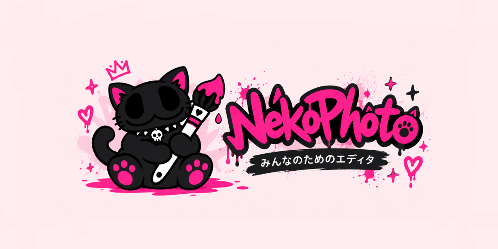
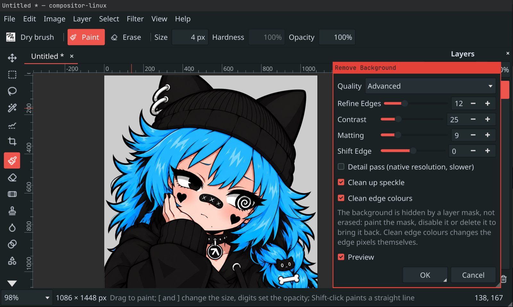
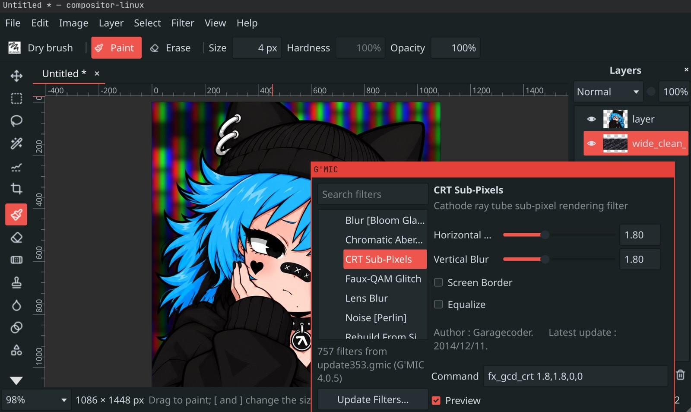

<p align="center">
  
</p>

# NekoPhoto

**English** · [日本語](#日本語)

**Bring your work with you from any major platform.** NekoPhoto is a fast,
focused photo editor and painting app for Linux that opens the files and brushes
you already have: Photoshop and Clip Studio projects with their layers intact,
and brushes from Photoshop, Clip Studio and Procreate. It saves back to layered
PSD, so it fits into a workflow shared with Photoshop, Krita and Photopea. Layers, masks,
selections, brushes, adjustments and filters work with the tools and shortcuts
you know.

NekoPhoto began as a Linux port of [Compositor](https://github.com/robbietilton/Compositor)
for macOS, and still opens its `.comp` projects. Until version 1.0 it was
called compositor-linux; your settings, brushes and downloaded model move over
by themselves the first time you start it.

## Bring your work with you

| Coming from | Your files | Your brushes and habits |
|---|---|---|
| **Photoshop** | `.psd` and `.psb` open with their layers, folders, masks, clipping masks and blend modes, layer styles, vector shapes, smart objects and editable text, and export back to layered `.psd` with all of it still Photoshop's | `.abr` brushes; the tools and shortcuts you know (V, M, L, W, B, E, `[` `]`, Ctrl+T, Ctrl+J, Ctrl+G) |
| **Clip Studio Paint** | `.clip` projects open with their layers, folders, masks, clipping and blend modes | `.sut` brushes |
| **Procreate** | Your exported images | `.brushset` and `.brush` files |
| **Krita and GIMP** | Photoshop files from collaborators, and your images | The MyPaint brush engine you know, and G'MIC's filters |

PSD export is round-trip tested: every layered PSD we have, from Photoshop and Clip Studio (up to 54
layers in 16 folders at 4096 × 4096), exports and reopens with the same pixels, and the files open in other
PSD readers with their structure intact. What NekoPhoto does not edit yet goes back byte for byte (118
Photoshop-saved test files round-trip unchanged), and layer styles, vector shapes and folders are drawn as
Photoshop draws them, most within a level of its own renders. What PSD cannot carry is listed before you export
([docs/psd-roundtrip.md](docs/psd-roundtrip.md), [docs/psd-export.md](docs/psd-export.md)).

Coming next:

- **Brushes that feel the same**: a deeper translation of Clip Studio and Photoshop brush settings, so your favourite brush behaves as it did

## What it does

- **Layers:** folders, blend modes, opacity, layer masks, clipping masks and adjustment layers
- **Transform:** move, scale, rotate and distort without losing resolution
- **Selections:** marquee, lasso, Quick Select by scribble or by click, Content-Aware Fill, and an edge-aware magic wand: shading and texture stay in, edges hold, the tolerance can be changed right after a click, Shift/Alt-clicks add what belongs and what doesn't, and with Contiguous off one click takes a background in many pockets (a baked checkerboard around a character) and Delete leaves the line art without a rim of the background ([docs/smart-wand.md](docs/smart-wand.md))
- **Painting:** brush, eraser, spot healing, clone stamp, smudge, liquify, gradients, shapes and text
- **Brushes:** 196 MyPaint brushes (pencils, inks, charcoal, paint, smudging) that follow pen pressure and tilt, and your own brushes imported from Photoshop (`.abr`), Procreate (`.brushset`, `.brush`) and Clip Studio (`.sut`), or any image as a brush tip
- **Adjustments and filters:** levels, curves, hue/saturation, exposure, gradient map, grain, blurs, noise and lens correction
- **Remove Background:** an AI model that runs on your own machine; nothing is uploaded
- **G'MIC:** over 850 more filters with a live preview, when `gmic` is installed
- **Files:** Photoshop PSD and PSB, and Clip Studio `.clip` projects, with layers, folders, masks, clipping and blend modes; Photoshop's layer styles, vector shapes and masks drawn as it draws them ([docs/layer-styles.md](docs/layer-styles.md), [docs/vector-masks.md](docs/vector-masks.md)); smart objects you can place, convert, edit and replace without losing resolution ([docs/smart-objects.md](docs/smart-objects.md)); text that stays editable both ways; layered PSD export; projects of up to a gigapixel of layers; PNG, JPEG, WebP and TIFF export; several projects in tabs; crash recovery
- **AI agents:** Claude Code or any MCP client can drive the editor

The full list is in [docs/features.md](docs/features.md).

| Remove Background | G'MIC filters |
|:---:|:---:|
|  |  |

## Performance

The heavy work runs on every core. Times on a 12-core laptop (AMD Ryzen AI 9 HX 370):

| Task | Time |
|---|---|
| Open a 70 MB Photoshop file (17 layers at 4096 × 4096) | 0.7 s |
| Save it as a project | 1.3 s |
| Save a project with five 4096 × 4096 layers | 0.7 s (7.2 s in 0.6.0) |
| Open that project | 0.4 s (2.5 s in 0.6.0) |
| Export a 4096 × 4096 PNG | 0.24 s (1.8 s in 0.6.0) |
| Quick Select, per stroke | 0.16 s on average (0.65 s in 0.6.0) |
| Remove Background on a 10-megapixel photo | 1.7 s (8.3 s with every refinement on) |
| Gaussian blur on a 12-megapixel layer | under 0.1 s |

## Get it

Download the AppImage from the [Releases](../../releases) page, make it
executable, and run it. It works on any x86_64 Linux from 2022 on, under
Wayland or X11.

```bash
chmod +x NekoPhoto-*.AppImage
./NekoPhoto-*.AppImage
```

To add it to your app launcher, open `.comp` projects by double-click and
offer it for `.psd` files, run the integration script once (no root needed;
`--remove` undoes it):

```bash
curl -fsSL https://raw.githubusercontent.com/vomitselfie/nekophoto/main/tools/integrate-appimage.sh | bash -s -- NekoPhoto-*.AppImage
```

**On a Mac:** each release also has an unsigned app bundle for Apple
Silicon. Unzip it, move it to Applications, and open it with right-click >
Open the first time.

**Remove Background** is off until you turn it on in Edit > Preferences,
which downloads the model once.

## Use it with an AI agent

```bash
claude mcp add nekophoto -- uv run /path/to/nekophoto/mcp/nekophoto_mcp.py
```

Then ask for something like "open photo.jpg, remove the background, put a
dark gradient behind it and export result.png". See
[docs/automation.md](docs/automation.md).

## Build from source

```bash
# Arch / Manjaro
sudo pacman -S cmake ninja qt6-base qt6-svg qt6-wayland qt6-imageformats libpng libmypaint libraw zstd opencv
# Ubuntu 24.04
sudo apt install cmake ninja-build qt6-base-dev qt6-svg-dev qt6-wayland qt6-image-formats-plugins libpng-dev libmypaint-dev libraw-dev libzstd-dev libsqlite3-dev libgl1-mesa-dev libopencv-dev

cmake -S . -B build -G Ninja -DCMAKE_BUILD_TYPE=Release
cmake --build build -j
./build/src/app/nekophoto
```

macOS, build options, command-line flags and keyboard shortcuts are in
[docs/linux-port.md](docs/linux-port.md).

## License

GPL-3.0-or-later; see [LICENSE](LICENSE). Based on Compositor by Wonder
Assembly LLC, whose code keeps its MIT licence
([LICENSES/MIT-Compositor.txt](LICENSES/MIT-Compositor.txt)). Third-party
components and their licences are listed in
[THIRD-PARTY-NOTICES.md](THIRD-PARTY-NOTICES.md).

---

## 日本語

[English](#nekophoto) · **日本語**

**どのアプリからでも、作品をそのまま持ってこられます。** NekoPhoto は Linux 向けの軽快でシンプルな
写真編集・お絵描きソフトです。Photoshop とクリップスタジオのファイルをレイヤーを保ったまま開け、
Photoshop・クリップスタジオ・Procreate のブラシも読み込めます。レイヤー付きの PSD に保存し直せるので、
Photoshop・Krita・Photopea を使う人とのやり取りにもそのまま組み込めます。レイヤー、マスク、選択範囲、ブラシ、
色調補正、フィルターを、おなじみのツールとショートカットで操作できます。

NekoPhoto は macOS 版 [Compositor](https://github.com/robbietilton/Compositor) の
Linux 移植として始まり、今も Mac 版の `.comp` プロジェクトを開けます。バージョン 1.0 までは
compositor-linux という名前でした。設定・ブラシ・ダウンロード済みのモデルは、初回起動時に自動で引き継がれます。

### 作品をそのまま持ってくる

| 移行元 | ファイル | ブラシと操作 |
|---|---|---|
| **Photoshop** | `.psd`・`.psb` をレイヤー・フォルダー・マスク・クリッピングマスク・描画モード・レイヤースタイル・ベクターシェイプ・スマートオブジェクト・編集可能なテキストを保ったまま開け、それらを Photoshop のまま保ってレイヤー付きの `.psd` に書き出せます | `.abr` ブラシ、おなじみのツールとショートカット(V、M、L、W、B、E、`[` `]`、Ctrl+T、Ctrl+J、Ctrl+G) |
| **クリップスタジオ** | `.clip` をレイヤー・フォルダー・マスク・クリッピング・描画モードを保ったまま開けます | `.sut` ブラシ |
| **Procreate** | 書き出した画像 | `.brushset`・`.brush` |
| **Krita・GIMP** | 共同作業者から届いた Photoshop ファイルや画像 | おなじみの MyPaint ブラシエンジンと G'MIC フィルター |

PSD の書き出しは往復テスト済みです。手元にあるレイヤー付き PSD(Photoshop とクリップスタジオ製、4096 × 4096 で最大 54 レイヤー・16 フォルダー)は、
書き出して開き直してもピクセル単位で同じになり、ほかの PSD リーダーでも構造を保ったまま開けます。NekoPhoto がまだ編集できない要素はバイト単位でそのまま戻り(Photoshop で保存したテストファイル 118 個が変化なく往復します)、レイヤースタイル・ベクターシェイプ・フォルダーは Photoshop と同じように描画されます。PSD で表現できない要素は書き出す前に一覧表示されます
([docs/psd-export.md](docs/psd-export.md)、英語)。

今後の予定:

- **同じ描き心地のブラシ**: クリップスタジオや Photoshop のブラシ設定をより深く変換し、お気に入りのブラシがそのままの感覚で使えるように

### できること

- **レイヤー:** フォルダー、描画モード、不透明度、レイヤーマスク、クリッピングマスク、調整レイヤー
- **変形:** 解像度を落とさずに移動・拡大縮小・回転・自由変形
- **選択範囲:** 長方形・楕円選択、なげなわ、なぞる/クリックするだけのクイック選択、コンテンツに応じた塗りつぶし、そして輪郭を読み取る自動選択(陰影やテクスチャは含め、境界では止まります。クリック直後に許容値を変えて調整でき、Shift/Alt クリックで含めるもの・除くものを指示できます。「隣接」をオフにすれば、キャラクターの周りに分かれた背景も 1 クリックで選択でき、削除しても線画に背景の色が残りません)
- **描画:** ブラシ、消しゴム、スポット修復ブラシ、コピースタンプ、指先ツール、ゆがみ、グラデーション、シェイプ、テキスト
- **ブラシ:** 筆圧と傾きに反応する MyPaint ブラシ 196 種類(鉛筆、インク、木炭、絵の具、ぼかし)。Photoshop(`.abr`)、Procreate(`.brushset`・`.brush`)、クリップスタジオ(`.sut`)のブラシや、任意の画像をブラシ先端として読み込めます
- **色調補正とフィルター:** レベル補正、トーンカーブ、色相・彩度、露光量、グラデーションマップ、粒子、ぼかし、ノイズ、レンズ補正
- **背景を削除:** AI モデルは手元のマシンで動作し、画像はどこにも送信されません
- **G'MIC:** `gmic` をインストールすると、850 種類以上のフィルターをライブプレビュー付きで使えます
- **ファイル:** レイヤー・フォルダー・マスク・クリッピング・描画モードを保ったまま PSD/PSB とクリップスタジオの `.clip` を開け、レイヤー付き PSD に書き出せます。1 ギガピクセルまでのプロジェクト、PNG・JPEG・WebP・TIFF 書き出し、タブで複数のプロジェクト、クラッシュからの復元
- **AI エージェント:** Claude Code などの MCP クライアントから操作できます

機能の一覧は [docs/features.md](docs/features.md#日本語) にあります。

| 背景を削除 | G'MIC フィルター |
|:---:|:---:|
|  |  |

### パフォーマンス

重い処理はすべての CPU コアで並列に実行します。12 コアのノート PC(AMD Ryzen AI 9 HX 370)での計測値:

| 処理 | 時間 |
|---|---|
| 70 MB の Photoshop ファイルを開く(4096 × 4096 のレイヤー 17 枚) | 0.7 秒 |
| それをプロジェクトとして保存 | 1.3 秒 |
| 4096 × 4096 のレイヤー 5 枚のプロジェクトを保存 | 0.7 秒(0.6.0 では 7.2 秒) |
| そのプロジェクトを開く | 0.4 秒(0.6.0 では 2.5 秒) |
| 4096 × 4096 の PNG を書き出し | 0.24 秒(0.6.0 では 1.8 秒) |
| クイック選択(1 ストロークあたり) | 平均 0.16 秒(0.6.0 では 0.65 秒) |
| 1000 万画素の写真の背景を削除 | 1.7 秒(すべての補正をオンにして 8.3 秒) |
| 1200 万画素のレイヤーにぼかし(ガウス) | 0.1 秒未満 |

### 入手方法

[Releases](../../releases) ページから AppImage をダウンロードし、実行権限を付けて起動します。
2022 年以降の x86_64 Linux であれば、Wayland と X11 のどちらでも動作します。

```bash
chmod +x NekoPhoto-*.AppImage
./NekoPhoto-*.AppImage
```

アプリランチャーに登録し、`.comp` をダブルクリックで開けるようにして `.psd` の「別のアプリで開く」にも
表示させるには、統合スクリプトを一度実行します(root 権限は不要、`--remove` で元に戻せます):

```bash
curl -fsSL https://raw.githubusercontent.com/vomitselfie/nekophoto/main/tools/integrate-appimage.sh | bash -s -- NekoPhoto-*.AppImage
```

**Mac の場合:** 各リリースには Apple シリコン向けの未署名アプリも含まれます。
展開して「アプリケーション」に移動し、初回だけ右クリック >「開く」で起動してください。

**背景を削除** は、編集 > 環境設定 でオンにすると使えるようになります(モデルを一度だけダウンロードします)。

### AI エージェントから使う

```bash
claude mcp add nekophoto -- uv run /path/to/nekophoto/mcp/nekophoto_mcp.py
```

あとは「photo.jpg を開いて背景を削除し、後ろに暗いグラデーションを敷いて result.png に書き出して」
のように頼むだけです。詳しくは [docs/automation.md](docs/automation.md)(英語)をご覧ください。

### ソースからビルド

必要なパッケージとビルド手順は、英語版の [Build from source](#build-from-source) と同じです。
macOS でのビルド、オプション、キーボードショートカットは [docs/linux-port.md](docs/linux-port.md)(英語)にあります。

### ライセンス

GPL-3.0-or-later です([LICENSE](LICENSE))。Wonder Assembly LLC の Compositor を元にしており、
その部分のコードは MIT ライセンスのままです([LICENSES/MIT-Compositor.txt](LICENSES/MIT-Compositor.txt))。
サードパーティー製コンポーネントとそのライセンスは [THIRD-PARTY-NOTICES.md](THIRD-PARTY-NOTICES.md) にまとめています。
