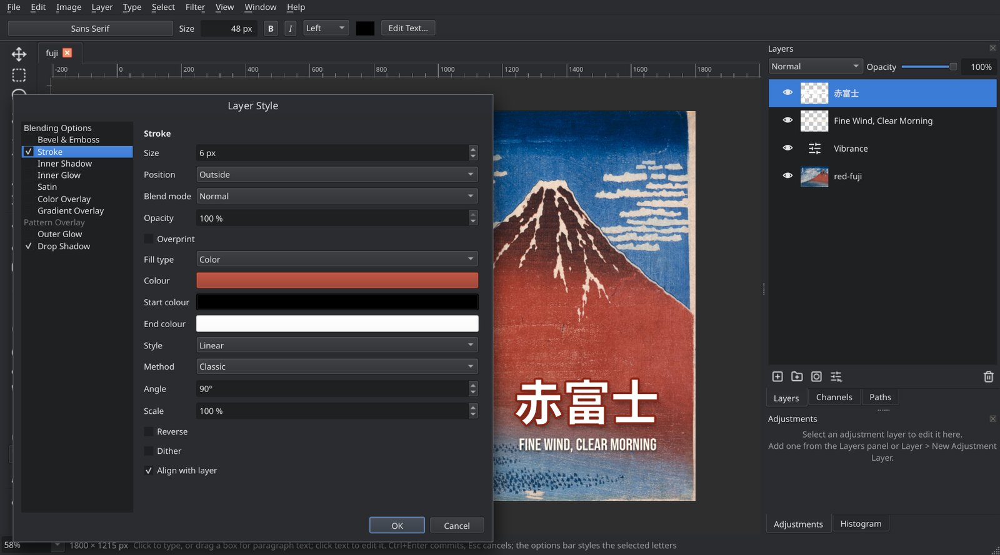
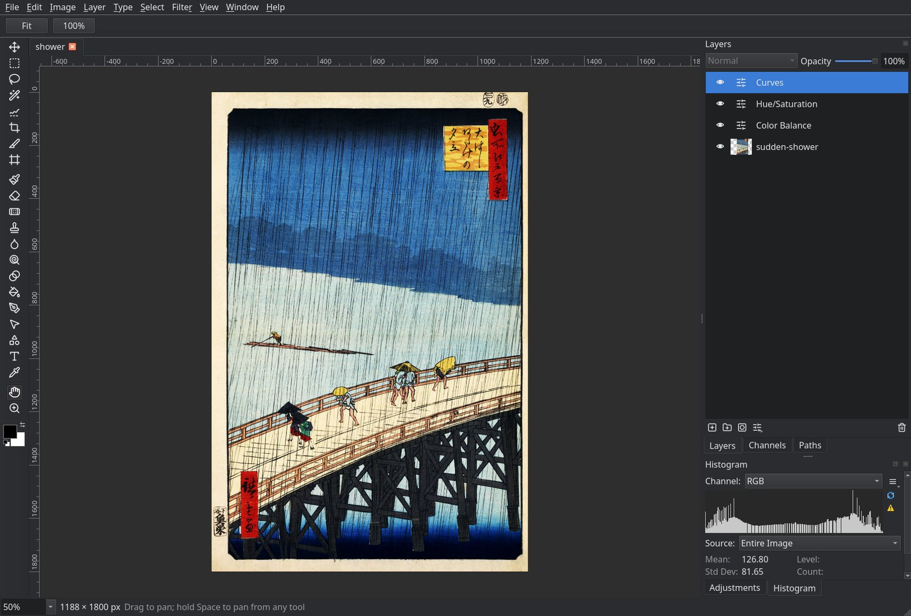
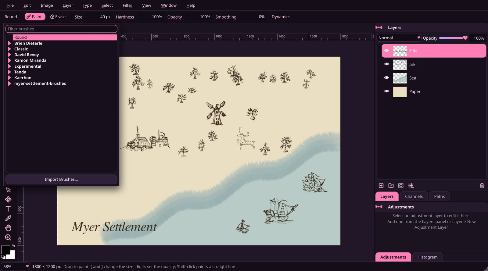
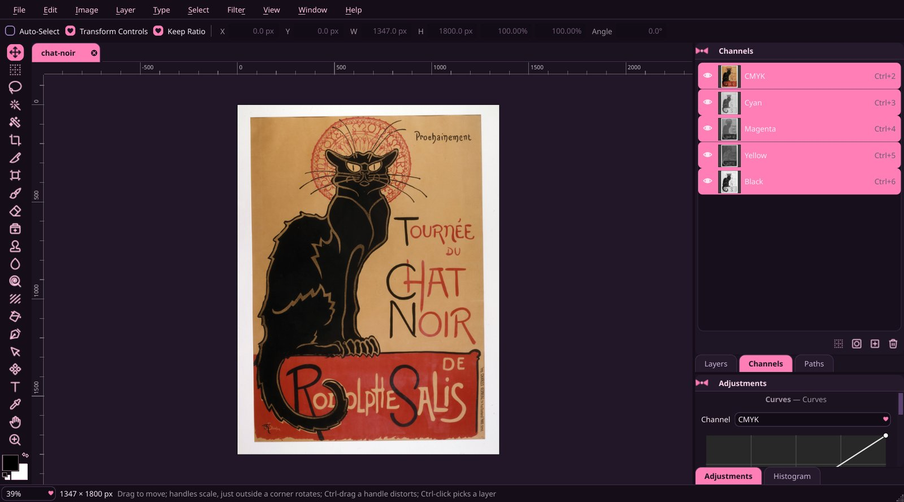
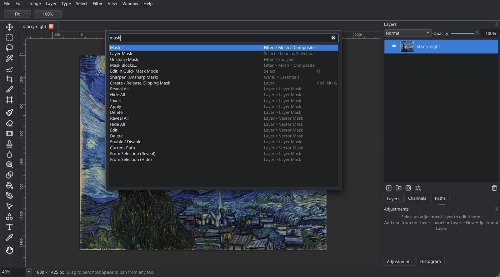
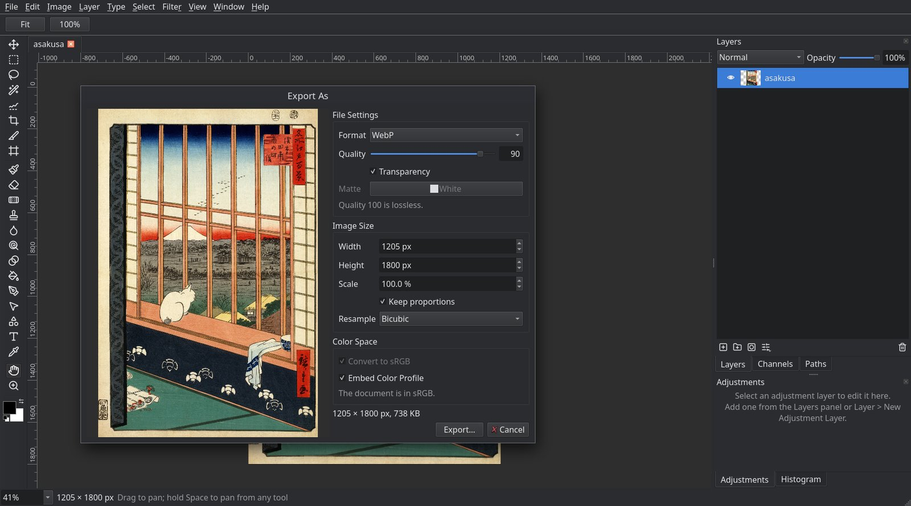
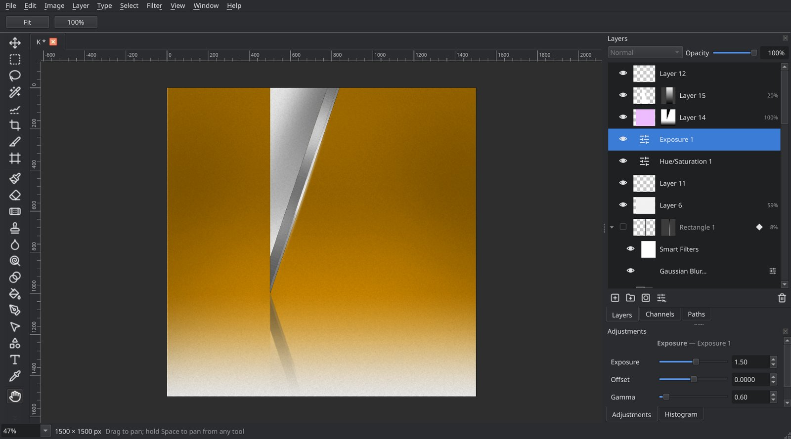
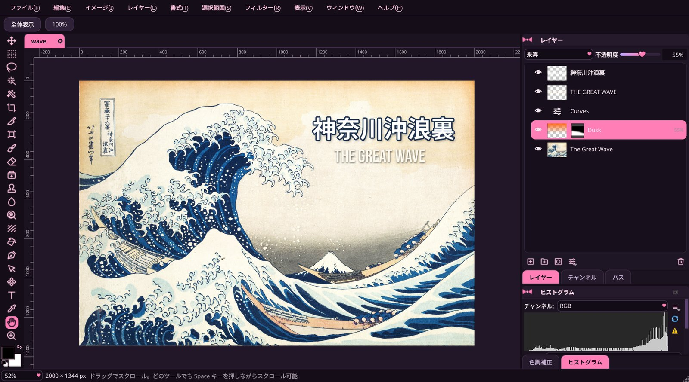

<p align="center">
  
</p>

<a name="english"></a>
<h1 align="center">NekoPhoto</h1>

<p align="center">
  <b>Bring your work with you.</b><br>
  A photo editor and painting app for Linux and Windows that opens your Photoshop and Clip Studio files<br>
  with their layers, masks and text intact, paints with your own brushes, and saves back to layered PSD.
</p>

<p align="center">
  <a href="https://github.com/vomitselfie/nekophoto/releases/latest"></a>
  
  
  <a href="LICENSE"></a>
  
  <br>
  <a href="https://github.com/vomitselfie/nekophoto/actions/workflows/linux.yml"></a>
  <a href="https://github.com/vomitselfie/nekophoto/actions/workflows/windows.yml"></a>
  <!-- compat-badges:start (tools/compat_table.py --write) -->
  <a href="docs/compatibility.md#at-a-glance"></a>
  <a href="docs/compatibility.md#at-a-glance"></a>
  <a href="docs/compatibility.md#at-a-glance"></a>
  <a href="docs/automation.md"></a>
  <!-- compat-badges:end -->
</p>

<p align="center">
  <a href="https://github.com/vomitselfie/nekophoto/releases/latest"><b>Download for Linux (AppImage)</b></a> ·
  <a href="https://github.com/vomitselfie/nekophoto/releases/latest"><b>Download for Windows (portable zip)</b></a><br>
  <sub>Linux: any x86_64 distribution from 2022 on, Wayland or X11. Windows: 10 version 1903 or later, x86_64.</sub>
</p>

<p align="center">
  
  <br>
  <sub>A layered document: styled type, a Curves adjustment layer and a masked Multiply layer warming the sky.<br><a href="https://commons.wikimedia.org/wiki/File:Tsunami_by_hokusai_19th_century.jpg"><i>The Great Wave off Kanagawa</i></a>, Katsushika Hokusai, c. 1830–32</sub>
</p>

<p align="center">
  <a href="#features">Features</a> ·
  <a href="#everything-in-the-box">Everything in the box</a> ·
  <a href="#psd-that-comes-back">PSD</a> ·
  <a href="#built-for-scripts-and-agents">Agents</a> ·
  <a href="#get-started">Get started</a> ·
  <a href="#documentation">Docs</a> ·
  <a href="#license-and-credits">License</a> ·
  <a href="#日本語">日本語</a>
</p>

<br>

<table>
  <tr>
    <td width="25%" valign="top">
      <h3>📂 Your files, your brushes</h3>
      Photoshop PSD and PSB, Clip Studio <code>.clip</code>, Affinity and camera RAW open with their layers. Photoshop <code>.abr</code>, Procreate and Clip Studio brushes import with their dynamics. Your work goes back out as layered PSD.
    </td>
    <td width="25%" valign="top">
      <h3>⌨️ Photoshop habits work</h3>
      The tools, menus and shortcuts are Photoshop's, held keys and spring-loaded tools included. Lost? Edit › Search (Ctrl+F) finds any command, tool or filter by name.
    </td>
    <td width="25%" valign="top">
      <h3>🎨 Colour, done properly</h3>
      8, 16 and 32 bits per channel. RGB, CMYK and Lab documents edited in their own colours, managed with ICC profiles, with the blend modes Photoshop offers in each mode.
    </td>
    <td width="25%" valign="top">
      <h3>🐾 Yours, on your machine</h3>
      A native Qt app with no account and no cloud. Remove Background and Select Subject run locally: nothing is uploaded. Open source under the GPL, in English and Japanese.
    </td>
  </tr>
</table>

<br>

## Features

Every screenshot here is the real app, rendered offscreen and set up through its automation socket. The artworks are
public-domain prints and paintings from Wikimedia Commons unless a credit says otherwise.

<table>
  <tr>
    <td width="50%" valign="top">
      
      <br>
      <sub>Live type with a Stroke and a Drop Shadow, edited in the Layer Style dialog.<br><a href="https://commons.wikimedia.org/wiki/File:Katsushika_Hokusai_-_Fine_Wind,_Clear_Morning_(Gaif%C5%AB_kaisei)_-_Google_Art_Project.jpg"><i>Fine Wind, Clear Morning</i></a>, Katsushika Hokusai, c. 1830–32</sub>
      <h3>Type that stays type</h3>
      Click and type on the canvas, in any installed font, with Japanese input composing right in the line. Style single letters, set paragraphs in a box, and keep every word editable.
      <br><br>
      Drop and inner shadows, glows, bevel and emboss, satin, overlays and stroke go on any layer from Photoshop's Layer Style dialog, drawn as Photoshop draws them and written back to PSD as its own. Import <code>.asl</code> styles, <code>.pat</code> patterns and <code>.grd</code> gradients.
    </td>
    <td width="50%" valign="top">
      
      <br>
      <sub>Curves, Hue/Saturation and Color Balance adjustment layers over a print, with the Histogram panel.<br><a href="https://commons.wikimedia.org/wiki/File:Hiroshige,_Sudden_shower_over_Shin-%C5%8Chashi_bridge_and_Atake,_1857.jpg"><i>Sudden Shower over Shin-Ōhashi Bridge and Atake</i></a>, Utagawa Hiroshige, 1857</sub>
      <h3>Edit without regret</h3>
      Seventeen adjustment layers, from Levels and Curves to Black &amp; White, Selective Color and Color Lookup, keep every change live: mask them, stack them, switch them off. Your pixels never change, and the layers go out to PSD as Photoshop's own.
      <br><br>
      Hold Alt on Levels or Curves to see exactly what clips, and read the Histogram panel's channels and statistics as you go.
    </td>
  </tr>
  <tr>
    <td width="50%" valign="top">
      
      <br>
      <sub>Remove Background previews the cut-out before you commit; the background goes into a layer mask.<br>Photo: <a href="https://commons.wikimedia.org/wiki/File:Welchcorgipembroke.JPG">Welchcorgipembroke.JPG</a> by pmuths1956 (2008), CC BY-SA 3.0</sub>
      <h3>Cut-outs that never leave your machine</h3>
      Remove Background, Select Subject and Quick Select run on your own computer, with models you download once. Nothing is uploaded and there is no account.
      <br><br>
      Advanced settings refine edges, solve hair and fur, clean up the edge colours and run a detail pass on large photos. The background is hidden by a mask, never erased, so you can paint it back.
    </td>
    <td width="50%" valign="top">
      
      <br>
      <sub>A map stamped with an imported Photoshop <code>.abr</code> set and a MyPaint watercolour coast.<br>Brushes: <a href="https://kmalexander.com/">“Myer Settlement Brushes”</a> by K. M. Alexander, CC0</sub>
      <h3>Paint with the brushes you already own</h3>
      Import Photoshop <code>.abr</code>, Procreate <code>.brushset</code> and <code>.brush</code>, and Clip Studio <code>.sut</code> brushes with their pressure curves, tapers and jitter, or turn any image into a tip.
      <br><br>
      196 MyPaint brushes come built in: pencils, inks, charcoal, oils and watercolours that follow pen pressure and tilt, with Photoshop's Smoothing and Pulled String Mode.
    </td>
  </tr>
  <tr>
    <td width="50%" valign="top">
      
      <br>
      <sub>A poster converted to CMYK: its own channels in the Channels panel and CMYK Curves.<br><a href="https://commons.wikimedia.org/wiki/File:Th%C3%A9ophile-Alexandre_Steinlen_-_Tourn%C3%A9e_du_Chat_Noir_de_Rodolphe_Salis_(Tour_of_Rodolphe_Salis%27_Chat_Noir)_-_Google_Art_Project.jpg"><i>Tournée du Chat Noir de Rodolphe Salis</i></a>, Théophile-Alexandre Steinlen, 1896</sub>
      <h3>Print-ready, natively</h3>
      Open CMYK and Lab PSDs in their own mode, or convert with Image › Mode through your working CMYK profile. Paint, retouch, adjust, filter, type and use layer styles right in CMYK and Lab, with the blend modes Photoshop offers there.
      <br><br>
      Color Settings, Assign and Convert to Profile, a CMYK proof, and 16-bit and 32-bit HDR documents with HDR Toning.
    </td>
    <td width="50%" valign="top">
      
      <br>
      <sub>Filter › Mosh › Halftone previewing live on the canvas.<br><a href="https://commons.wikimedia.org/wiki/File:Kuniyoshi_Utagawa,_For_cats_in_different_poses.jpg"><i>Cats in different poses</i></a>, from <i>Tatoe-zukushi no uchi</i>, Utagawa Kuniyoshi, 1852</sub>
      <h3>A Filter menu to get lost in</h3>
      Photoshop's Filter menu in its own submenus: blurs, distortions, noise, pixelate, render, sharpen and stylize, previewing on the canvas inside your selection. Many go on a smart object as Smart Filters you can reorder, mask and edit later.
      <br><br>
      Plus the Camera Raw Filter (Shift+Ctrl+A), more than 850 G'MIC filters when <code>gmic</code> is installed, and 54 glitch and retro effects under Filter › Mosh.
    </td>
  </tr>
  <tr>
    <td width="50%" valign="top">
      
      <br>
      <sub>Edit › Search finds menu commands, tools and G'MIC filters by a few letters.<br><a href="https://commons.wikimedia.org/wiki/File:Van_Gogh_-_Starry_Night_-_Google_Art_Project.jpg"><i>The Starry Night</i></a>, Vincent van Gogh, 1889</sub>
      <h3>Works the way your hands expect</h3>
      Photoshop's tools and shortcuts, Shift+letter to step through a tool group, and its held keys: Ctrl for the Move tool, Alt for the Eyedropper while painting, a tool's letter held for a spring-loaded tool. Edit › Keyboard Shortcuts changes any key, with clashes caught as you type.
      <br><br>
      Right-click menus that fit the tool and what is under the pointer, rulers, guides and smart guides, labels you drag to change a number, and File › Revert (F12).
    </td>
    <td width="50%" valign="top">
      
      <br>
      <sub>Export As with a preview of the encoded file and its size.<br><a href="https://commons.wikimedia.org/wiki/File:Hiroshige,_Asakusa_ricefields_and_torinomachi_festival,_1857.jpg"><i>Asakusa Ricefields and Torinomachi Festival</i></a>, Utagawa Hiroshige, 1857</sub>
      <h3>Ship it anywhere</h3>
      Export As writes PNG, JPEG, GIF, WebP, TIFF or TGA with a live preview, the file's size, a new size, a matte and sRGB conversion, remembered per format. Quick Export in one click, Layer › Export As, artboards and slices to files in one go.
      <br><br>
      Record Actions as you work and run them over a folder with File › Automate › Batch.
    </td>
  </tr>
</table>

<br>

## Everything in the box

<table>
  <tr>
    <td width="33%" valign="top">
      <h4>🗂️ Layers</h4>
      Folders, all 27 of Photoshop's blend modes plus Pass Through, layer and vector masks, clipping masks, fill and adjustment layers, Blend If and Advanced Blending's channel boxes, smart objects you can place, convert, edit and replace, and whole layers copied between documents.
    </td>
    <td width="33%" valign="top">
      <h4>✂️ Selections and retouching</h4>
      Marquees, lassos, an edge-aware Magic Wand, Quick Select, Select Subject, Quick Mask and alpha channels. Spot Healing, Healing Brush, Patch, Clone Stamp, Content-Aware Fill, Move and Scale, Liquify, Dodge, Burn and Sponge.
    </td>
    <td width="33%" valign="top">
      <h4>✒️ Vectors and transforms</h4>
      The Pen, live shapes with path operations, gradient and pattern fills and strokes, the Paths panel, text to path. Free Transform without losing resolution, distort, Warp Cage, and the Crop tool's ratio presets.
    </td>
  </tr>
  <tr>
    <td width="33%" valign="top">
      <h4>📁 Files</h4>
      PSD and PSB, Clip Studio <code>.clip</code>, Affinity, camera RAW through Camera Raw, SVG, PDF, GIF and Aseprite with their frames, PNG, JPEG, WebP, TIFF, TGA and ICO. Projects save as one <code>.nekophoto</code> file, up to a gigapixel of layers.
    </td>
    <td width="33%" valign="top">
      <h4>🎞️ Animation and automation</h4>
      A frame Timeline with animated GIF export, Actions and Batch, and an automation socket with an MCP bridge for scripts and agents.
    </td>
    <td width="33%" valign="top">
      <h4>🛟 Peace of mind</h4>
      Crash recovery that autosaves unsaved work in the background, several documents in tabs, an open project that reloads when its file changes on disk, and a CPU setting that leaves room for the other programs you run.
    </td>
  </tr>
</table>

The full list, with every option, is in [docs/features.md](docs/features.md).

## PSD that comes back

<p align="center">
  
  <br>
  <sub>K.psd as Photoshop saved it: masks, adjustment layers and a smart object with its Smart Filters, all editable.<br><i>K</i> by <a href="https://www.nathanlincoln.com/">Nathan Lincoln</a>, used with permission.</sub>
</p>

<p align="center">
  
  <br>
  <sub>Open a PSD, edit, save it as PSD, reopen: recorded headless from NekoPhoto 1.6.1 over its automation socket.<br><i>K</i> by <a href="https://www.nathanlincoln.com/">Nathan Lincoln</a>, used with permission.</sub>
</p>

NekoPhoto is tested against real Photoshop files, and the numbers are published with the commands to check them yourself:

- **Round trip:** all 117 PSD and PSB files of the test corpus, nearly all saved by Photoshop 2026 (text, smart objects
  and Smart Filters, layer styles, shapes, masks, PSB), open, export and reopen with nothing lost; 3,675 blocks
  NekoPhoto does not edit go back byte for byte. Converted to 16 bits, they come back too.
- **Against Photoshop's own render:** 58 of 72 files render within 2 levels of what Photoshop shows on 99% of their
  pixels, compared with Photoshop's own flatten or the merged image it stored.
- **Colour:** the ICC profile of all 64 tagged RGB PSDs in the corpus is written back byte for byte.
- **No surprises:** what PSD cannot carry is listed before you export, and an unedited 16-bit layer goes back byte for byte.

The counts, the known gaps and how to rerun every check are in [Compatibility & correctness](docs/compatibility.md);
how export works is in [docs/psd-export.md](docs/psd-export.md) and [docs/psd-roundtrip.md](docs/psd-roundtrip.md).

## Built for scripts and agents

Everything an agent or a script does goes through the same editor session you see, lands in the undo history, and
shows on screen. 183 automation methods cover documents, layers, pixels, selections, painting and export.

Let Claude Code, or any MCP client, drive the editor:

```bash
claude mcp add nekophoto -- uv run /path/to/nekophoto/mcp/nekophoto_mcp.py
```

Then ask for something like “open photo.jpg, remove the background, put a dark gradient behind it and export
result.png”.

From a shell, send one request to the running editor, or run a file of requests in a windowless instance:

```bash
nekophoto --call layers.list
nekophoto --call render --params '{"path": "/tmp/check.png", "maxSize": 800}'
nekophoto --headless --batch grade.jsonl
```

```json
{"method": "document.open", "params": {"path": "/path/to/photo.jpg"}}
{"method": "layers.add", "params": {"kind": "adjustment", "adjustmentKind": "Vibrance", "settings": {"vibranceSettings": {"vibrance": 35}}}}
{"method": "document.export", "params": {"path": "/path/to/photo-graded.png"}}
```

The protocol, every method and the MCP tools are in [docs/automation.md](docs/automation.md).

## Get started

**Linux:** download the AppImage from the [Releases](https://github.com/vomitselfie/nekophoto/releases/latest) page,
make it executable and run it. It works on any x86_64 Linux from 2022 on, under Wayland or X11.

```bash
chmod +x NekoPhoto-*.AppImage
./NekoPhoto-*.AppImage
```

To add it to your app launcher, open `.nekophoto` and `.comp` projects by double-click and offer it for `.psd` files,
run the integration script once (no root needed; `--remove` undoes it):

```bash
curl -fsSL https://raw.githubusercontent.com/vomitselfie/nekophoto/main/tools/integrate-appimage.sh | bash -s -- NekoPhoto-*.AppImage
```

**Windows** (10 version 1903 or later, x86_64): download `NekoPhoto-<version>-windows-x86_64.zip` from the same page,
unzip it anywhere and run `nekophoto.exe`. It is portable: nothing is installed, and settings live in your user
profile. The G'MIC filters need `gmic.exe` on `PATH`.

**Good to know**

- **Remove Background** is off until you turn it on in Edit › Preferences, which downloads the model once. Quick Select's
  click mode downloads its own model from the options bar.
- The interface is in **English and Japanese**: it follows the desktop's language, and Edit › Preferences › Language
  picks one (at the next launch).
- NekoPhoto began as a Linux port of [Compositor](https://github.com/robbietilton/Compositor) for macOS and was called
  compositor-linux until 1.0; your settings, brushes and downloaded model move over by themselves. `.comp` project
  folders from older versions and the Mac app still open and save as they are.

### Build from source

```bash
# Arch / Manjaro
sudo pacman -S cmake ninja qt6-base qt6-svg qt6-wayland qt6-imageformats qt6-webengine libpng libmypaint libraw zstd opencv
# Ubuntu 24.04
sudo apt install cmake ninja-build qt6-base-dev qt6-svg-dev qt6-pdf-dev qt6-wayland qt6-image-formats-plugins libpng-dev libmypaint-dev libraw-dev libzstd-dev libsqlite3-dev libgl1-mesa-dev libopencv-dev

cmake -S . -B build -G Ninja -DCMAKE_BUILD_TYPE=Release
cmake --build build -j
./build/src/app/nekophoto
```

Windows builds with MinGW-w64 in MSYS2 (UCRT64); the packages and steps are in
[docs/linux-port.md](docs/linux-port.md#windows), as are build options, command-line flags and
[keyboard shortcuts](docs/linux-port.md#keyboard-shortcuts).

## Documentation

| | |
|---|---|
| [What NekoPhoto can do](docs/features.md) | every feature, menu by menu |
| [Compatibility & correctness](docs/compatibility.md) | what is tested against Photoshop, and what still differs |
| [Colour modes](docs/color-modes.md) · [Bit depth](docs/bit-depth.md) · [Colour management](docs/color-management.md) | CMYK, Lab, 16 and 32 bits, ICC profiles |
| [Layer styles](docs/layer-styles.md) · [Smart objects](docs/smart-objects.md) · [Vector tools](docs/vector-tools.md) | how they are drawn and kept in PSD |
| [Brush engine](docs/brush-engine.md) · [Camera Raw](docs/camera-raw.md) · [Remove Background](docs/remove-background.md) | painting, RAW development, cut-outs |
| [Actions](docs/actions.md) · [Automation and MCP](docs/automation.md) | recording, batches, scripts and agents |
| [Legal boundaries](docs/legal-boundaries.md) | the few features that deliberately work differently from Photoshop |

## Contributing

Building, the code's layout, the rules a change has to follow and how CI checks a pull request are in
[CONTRIBUTING.md](CONTRIBUTING.md). Report security problems privately as [SECURITY.md](SECURITY.md) describes.
Adding a language is explained in [docs/translating.md](docs/translating.md).

## License and credits

NekoPhoto is GPL-3.0-or-later; see [LICENSE](LICENSE). It is based on Compositor by Wonder Assembly LLC, whose code
keeps its MIT licence ([LICENSES/MIT-Compositor.txt](LICENSES/MIT-Compositor.txt)). Third-party components and their
licences are listed in [THIRD-PARTY-NOTICES.md](THIRD-PARTY-NOTICES.md).

Artwork in this README: *K* by [Nathan Lincoln](https://www.nathanlincoln.com/), used with permission; the corgi photo
[Welchcorgipembroke.JPG](https://commons.wikimedia.org/wiki/File:Welchcorgipembroke.JPG) by pmuths1956 (2008),
Wikimedia Commons, CC BY-SA 3.0; the CC0 “Myer Settlement Brushes” by K. M. Alexander; and public-domain prints and
paintings by Katsushika Hokusai, Utagawa Hiroshige, Utagawa Kuniyoshi, Théophile-Alexandre Steinlen and Vincent van
Gogh from Wikimedia Commons, each linked under its screenshot.

<sub>Adobe and Photoshop are trademarks of Adobe Inc. NekoPhoto is not affiliated with or endorsed by Adobe; Photoshop is
named only to describe compatibility. Clip Studio Paint is a trademark of CELSYS, Inc. and Procreate of Savage
Interactive Pty Ltd. A few features deliberately work differently from Photoshop: see
[docs/legal-boundaries.md](docs/legal-boundaries.md).</sub>

---

## 日本語

<p align="center"><a href="#english">English</a> · <b>日本語</b></p>

<p align="center">
  <a href="https://github.com/vomitselfie/nekophoto/actions/workflows/linux.yml"></a>
  <a href="https://github.com/vomitselfie/nekophoto/actions/workflows/windows.yml"></a>
  <!-- compat-badges-ja:start (tools/compat_table.py --write) -->
  <a href="docs/compatibility.md#日本語"></a>
  <a href="docs/compatibility.md#日本語"></a>
  <a href="docs/compatibility.md#日本語"></a>
  <a href="docs/automation.md"></a>
  <!-- compat-badges-ja:end -->
</p>

<p align="center">
  <b>作品をそのまま持ってこられます。</b><br>
  Linux・Windows 向けの写真編集・お絵描きソフトです。Photoshop とクリップスタジオのファイルを<br>
  レイヤー・マスク・テキストを保ったまま開き、手持ちのブラシで描き、レイヤー付きの PSD に保存し直せます。
</p>

<p align="center">
  <a href="https://github.com/vomitselfie/nekophoto/releases/latest"><b>Linux 版をダウンロード(AppImage)</b></a> ·
  <a href="https://github.com/vomitselfie/nekophoto/releases/latest"><b>Windows 版をダウンロード(ポータブル zip)</b></a><br>
  <sub>Linux: 2022 年以降の x86_64 ディストリビューション(Wayland・X11)。Windows: 10 バージョン 1903 以降(x86_64)。</sub>
</p>

<p align="center">
  
  <br>
  <sub>日本語表示で編集中のドキュメント: スタイル付きのテキスト、トーンカーブの調整レイヤー、マスクで空だけを温める乗算のレイヤー。<br><a href="https://commons.wikimedia.org/wiki/File:Tsunami_by_hokusai_19th_century.jpg">葛飾北斎『冨嶽三十六景 神奈川沖浪裏』</a>(1830〜32 年頃)</sub>
</p>

<p align="center">
  <a href="#機能">機能</a> ·
  <a href="#ほかにもいろいろ">ほかにもいろいろ</a> ·
  <a href="#psd-はそのまま戻ってくる">PSD</a> ·
  <a href="#スクリプトと-ai-エージェントから使う">エージェント</a> ·
  <a href="#はじめかた">はじめかた</a> ·
  <a href="#ドキュメント">ドキュメント</a> ·
  <a href="#ライセンスとクレジット">ライセンス</a>
</p>

<table>
  <tr>
    <td width="25%" valign="top">
      <h3>📂 手持ちのファイルとブラシ</h3>
      Photoshop の PSD・PSB、クリップスタジオの <code>.clip</code>、Affinity、カメラ RAW をレイヤーごと開けます。Photoshop の <code>.abr</code>、Procreate・クリップスタジオのブラシはダイナミクスごと読み込めます。保存はレイヤー付きの PSD で。
    </td>
    <td width="25%" valign="top">
      <h3>⌨️ Photoshop の手癖のままで</h3>
      ツール・メニュー・ショートカットは Photoshop と同じ。押している間だけの一時切り替えにも対応しています。迷ったら 編集 › 検索(Ctrl+F)で、コマンド・ツール・フィルターを名前で探せます。
    </td>
    <td width="25%" valign="top">
      <h3>🎨 本物の色</h3>
      8・16・32 ビット/チャンネル。RGB・CMYK・Lab のドキュメントをそのままの色で編集し、ICC プロファイルでカラーマネジメント。描画モードは各モードで Photoshop と同じものが使えます。
    </td>
    <td width="25%" valign="top">
      <h3>🐾 あなたのマシンの中で</h3>
      アカウントもクラウドも不要なネイティブ Qt アプリです。背景を削除・被写体を選択は手元で動作し、画像はどこにも送信されません。GPL のオープンソースで、英語と日本語に対応。
    </td>
  </tr>
</table>

### 機能

スクリーンショットはすべて実際のアプリを画面なしで起動し、自動操作ソケットで準備して撮影したものです。作品は、クレジットに
別記がない限り Wikimedia Commons のパブリックドメインの版画・絵画です。

<table>
  <tr>
    <td width="50%" valign="top">
      
      <br>
      <sub>境界線とドロップシャドウを付けたテキストを、レイヤースタイルのダイアログで編集。<br><a href="https://commons.wikimedia.org/wiki/File:Katsushika_Hokusai_-_Fine_Wind,_Clear_Morning_(Gaif%C5%AB_kaisei)_-_Google_Art_Project.jpg">葛飾北斎『冨嶽三十六景 凱風快晴』</a>(1830〜32 年頃)</sub>
      <h3>文字はずっと文字のまま</h3>
      カンバスをクリックしてそのまま入力。インストール済みのどのフォントでも使え、日本語入力も行の中で変換できます。1 文字ずつのスタイル、ボックスでの段落組みも可能で、文字はいつでも編集し直せます。
      <br><br>
      シャドウ、光彩、ベベルとエンボス、サテン、オーバーレイ、境界線を Photoshop と同じレイヤースタイルのダイアログで付けられ、Photoshop と同じように描画して PSD に書き戻します。<code>.asl</code> スタイル・<code>.pat</code> パターン・<code>.grd</code> グラデーションも読み込めます。
    </td>
    <td width="50%" valign="top">
      
      <br>
      <sub>トーンカーブ・色相・彩度・カラーバランスの調整レイヤーとヒストグラムパネル。<br><a href="https://commons.wikimedia.org/wiki/File:Hiroshige,_Sudden_shower_over_Shin-%C5%8Chashi_bridge_and_Atake,_1857.jpg">歌川広重『名所江戸百景 大はしあたけの夕立』</a>(1857 年)</sub>
      <h3>やり直しのきく補正</h3>
      レベル補正・トーンカーブから白黒・特定色域の選択・カラールックアップまで、17 種類の調整レイヤーで補正をいつでも変更できます。マスクを付けても、重ねても、オフにしても元のピクセルは変わらず、PSD には Photoshop の調整レイヤーとして書き出されます。
      <br><br>
      レベル補正やトーンカーブで Alt を押しながらドラッグすると白飛び・黒つぶれする部分が見え、ヒストグラムパネルでチャンネルごとの分布と統計値を確認できます。
    </td>
  </tr>
  <tr>
    <td width="50%" valign="top">
      
      <br>
      <sub>背景を削除は確定前に切り抜きをプレビューし、背景はレイヤーマスクで隠します。<br>写真: pmuths1956 による <a href="https://commons.wikimedia.org/wiki/File:Welchcorgipembroke.JPG">Welchcorgipembroke.JPG</a>(2008 年、CC BY-SA 3.0)</sub>
      <h3>切り抜きは手元のマシンで</h3>
      背景を削除・被写体を選択・クイック選択は、一度ダウンロードしたモデルを使ってあなたのコンピューターの中で動きます。画像はどこにも送信されず、アカウントも要りません。
      <br><br>
      詳細設定では境界の調整、髪や毛並みの処理、境界の色の除去、大きな写真のための精細パスが使えます。背景は消すのではなくマスクで隠すので、描き戻すこともできます。
    </td>
    <td width="50%" valign="top">
      
      <br>
      <sub>読み込んだ Photoshop の <code>.abr</code> ブラシセットと MyPaint の水彩で描いた地図。<br>ブラシ: K. M. Alexander による <a href="https://kmalexander.com/">「Myer Settlement Brushes」</a>(CC0)</sub>
      <h3>いつものブラシで描く</h3>
      Photoshop の <code>.abr</code>、Procreate の <code>.brushset</code>・<code>.brush</code>、クリップスタジオの <code>.sut</code> を、筆圧カーブ・入り抜き・ジッターごと読み込めます。任意の画像をブラシ先端にすることもできます。
      <br><br>
      筆圧と傾きに反応する MyPaint ブラシ 196 種類(鉛筆、インク、木炭、油彩、水彩)を内蔵。Photoshop と同じ滑らかさとストリングを引くモードも使えます。
    </td>
  </tr>
  <tr>
    <td width="50%" valign="top">
      
      <br>
      <sub>CMYK に変換したポスター。チャンネルパネルに各版が並び、トーンカーブも CMYK で。<br><a href="https://commons.wikimedia.org/wiki/File:Th%C3%A9ophile-Alexandre_Steinlen_-_Tourn%C3%A9e_du_Chat_Noir_de_Rodolphe_Salis_(Tour_of_Rodolphe_Salis%27_Chat_Noir)_-_Google_Art_Project.jpg">テオフィル＝アレクサンドル・スタンラン『Tournée du Chat Noir de Rodolphe Salis』</a>(1896 年)</sub>
      <h3>印刷用データもそのまま</h3>
      CMYK・Lab の PSD はそのモードのまま開け、イメージ › モードで作業用 CMYK プロファイルを使って変換できます。描画・修正・色調補正・フィルター・文字・レイヤースタイルを CMYK・Lab のまま使え、描画モードも Photoshop がそのモードで用意しているものが使えます。
      <br><br>
      カラー設定、プロファイルの指定・変換、CMYK の校正表示、16 ビット、HDR トーン付きの 32 ビット HDR ドキュメントにも対応しています。
    </td>
    <td width="50%" valign="top">
      
      <br>
      <sub>フィルター › Mosh › ハーフトーンをカンバス上でプレビュー。<br><a href="https://commons.wikimedia.org/wiki/File:Kuniyoshi_Utagawa,_For_cats_in_different_poses.jpg">歌川国芳『たとえ尽の内』より、さまざまな姿の猫</a>(1852 年)</sub>
      <h3>試しきれないほどのフィルター</h3>
      Photoshop と同じサブメニューに並ぶフィルター(ぼかし、変形、ノイズ、ピクセレート、描画、シャープ、表現手法)は、選択範囲の中でカンバス上にプレビューされます。多くはスマートオブジェクトにスマートフィルターとして適用でき、あとから並べ替え・マスク・編集ができます。
      <br><br>
      さらに Camera Raw フィルター(Shift+Ctrl+A)、<code>gmic</code> をインストールすれば 850 種類以上の G'MIC フィルター、フィルター › Mosh の 54 種類のグリッチ・レトロ効果も使えます。
    </td>
  </tr>
  <tr>
    <td width="50%" valign="top">
      
      <br>
      <sub>編集 › 検索 で、メニューのコマンド・ツール・G'MIC フィルターを数文字で探せます(画面は英語表示)。<br><a href="https://commons.wikimedia.org/wiki/File:Van_Gogh_-_Starry_Night_-_Google_Art_Project.jpg">フィンセント・ファン・ゴッホ『星月夜』</a>(1889 年)</sub>
      <h3>手が覚えている操作のままで</h3>
      Photoshop と同じツールとショートカット、Shift+キーでのツールグループの切り替え、押している間だけのキー(Ctrl で移動ツール、描画中の Alt でスポイト、ツールのキーを押し続けて一時的に切り替え)。編集 › キーボードショートカット でどのキーも変更でき、重複はその場で知らせます。
      <br><br>
      ツールとポインター下の対象に合わせた右クリックメニュー、定規・ガイド・スマートガイド、ドラッグで数値を変えられるラベル、ファイル › 復帰(F12)。
    </td>
    <td width="50%" valign="top">
      
      <br>
      <sub>書き出し形式。書き出したファイルのプレビューとサイズを確認できます。<br><a href="https://commons.wikimedia.org/wiki/File:Hiroshige,_Asakusa_ricefields_and_torinomachi_festival,_1857.jpg">歌川広重『名所江戸百景 浅草田甫酉の町詣』</a>(1857 年)</sub>
      <h3>どこへでも書き出せる</h3>
      書き出し形式で PNG・JPEG・GIF・WebP・TIFF・TGA を、プレビュー・ファイルサイズ・画像サイズ・マット・sRGB 変換を確認しながら書き出せ、設定は形式ごとに記憶されます。クイック書き出し、レイヤー › 書き出し形式、アートボードとスライスの一括書き出しも。
      <br><br>
      作業をアクションとして記録し、ファイル › 自動処理 › バッチでフォルダーごと処理できます。
    </td>
  </tr>
</table>

### ほかにもいろいろ

<table>
  <tr>
    <td width="33%" valign="top">
      <h4>🗂️ レイヤー</h4>
      グループ、Photoshop の 27 種類の描画モードと通過、レイヤーマスクとベクトルマスク、クリッピングマスク、塗りつぶしレイヤーと調整レイヤー、ブレンド条件と高度な合成のチャンネル指定、配置・変換・編集・置き換えのできるスマートオブジェクト、ドキュメント間でのレイヤーのコピー。
    </td>
    <td width="33%" valign="top">
      <h4>✂️ 選択と修正</h4>
      長方形・楕円選択、なげなわ、輪郭を読み取る自動選択、クイック選択、被写体を選択、クイックマスク、アルファチャンネル。スポット修復ブラシ、修復ブラシ、パッチ、コピースタンプ、コンテンツに応じた塗りつぶし・移動・拡大・縮小、ゆがみ、覆い焼き・焼き込み・スポンジ。
    </td>
    <td width="33%" valign="top">
      <h4>✒️ ベクターと変形</h4>
      ペン、パスの結合ができるライブシェイプ、グラデーション・パターンの塗りと線、パスパネル、テキストのパス化。解像度を落とさない自由変形、ワープケージ、比率プリセット付きの切り抜きツール。
    </td>
  </tr>
  <tr>
    <td width="33%" valign="top">
      <h4>📁 ファイル</h4>
      PSD・PSB、クリップスタジオの <code>.clip</code>、Affinity、Camera Raw で開くカメラ RAW、SVG、PDF、フレームごとの GIF・Aseprite、PNG・JPEG・WebP・TIFF・TGA・ICO。プロジェクトは 1 つの <code>.nekophoto</code> ファイルに保存し、1 ギガピクセルまでのレイヤーを扱えます。
    </td>
    <td width="33%" valign="top">
      <h4>🎞️ アニメーションと自動化</h4>
      フレームタイムラインとアニメーション GIF の書き出し、アクションとバッチ、スクリプトや AI エージェントのための自動操作ソケットと MCP ブリッジ。
    </td>
    <td width="33%" valign="top">
      <h4>🛟 安心して使える</h4>
      未保存の作業をバックグラウンドで自動保存するクラッシュからの復元、タブで複数のドキュメント、ファイルが外部で変更されると開いているプロジェクトを再読み込み、ほかのプログラムに CPU を譲る設定。
    </td>
  </tr>
</table>

機能の一覧は [docs/features.md](docs/features.md#日本語) にあります。

### PSD はそのまま戻ってくる

<p align="center">
  
  <br>
  <sub>Photoshop で保存されたままの K.psd: マスク、調整レイヤー、スマートフィルター付きのスマートオブジェクトをすべて編集できます(画面は英語表示)。<br>作品: <a href="https://www.nathanlincoln.com/">Nathan Lincoln</a>『K』(許可を得て使用)</sub>
</p>

<p align="center">
  
  <br>
  <sub>PSD を開いて編集し、PSD に保存して開き直す: NekoPhoto 1.6.1 を画面なしで起動し、自動操作ソケット経由で記録。<br>作品: <a href="https://www.nathanlincoln.com/">Nathan Lincoln</a>『K』(許可を得て使用)</sub>
</p>

NekoPhoto は実際の Photoshop ファイルで検証しており、その数値を確認用のコマンドとともに公開しています。

- **往復:** テスト用の PSD・PSB ファイル 117 個(ほぼすべて Photoshop 2026 で保存。テキスト、スマートオブジェクトとスマートフィルター、
  レイヤースタイル、シェイプ、マスク、PSB を網羅)は、開いて書き出し、開き直しても何も失われません。NekoPhoto が編集しない
  3,675 個のブロックはバイト単位でそのまま戻ります。16 ビットに変換しても同様です。
- **Photoshop 自身の描画と比較:** 72 個中 58 個のファイルが、ピクセルの 99% で Photoshop の表示と 2 レベル以内に収まります
  (Photoshop で統合した画像、またはファイルに保存された統合画像と比較)。
- **色:** テスト用ファイルのうちプロファイル付きの RGB PSD 64 個すべてで、ICC プロファイルがバイト単位でそのまま書き戻されます。
- **想定外なし:** PSD で表現できない要素は書き出す前に一覧表示され、編集していない 16 ビットのレイヤーはバイト単位でそのまま戻ります。

集計値・既知の差異・検証の再実行方法は [互換性と正確さ](docs/compatibility.md#日本語) に、書き出しのしくみは
[docs/psd-export.md](docs/psd-export.md) と [docs/psd-roundtrip.md](docs/psd-roundtrip.md)(英語)にまとめています。

### スクリプトと AI エージェントから使う

エージェントやスクリプトの操作は、画面に見えているのと同じ編集セッションを通り、取り消し履歴に残り、画面にも表示されます。
183 個の自動操作メソッドで、ドキュメント・レイヤー・ピクセル・選択範囲・描画・書き出しを扱えます。

Claude Code などの MCP クライアントから操作するには:

```bash
claude mcp add nekophoto -- uv run /path/to/nekophoto/mcp/nekophoto_mcp.py
```

あとは「photo.jpg を開いて背景を削除し、後ろに暗いグラデーションを敷いて result.png に書き出して」のように頼むだけです。

シェルからは、起動中のエディターにリクエストを 1 つ送ったり、リクエストを並べたファイルを画面なしのインスタンスで実行したりできます
(ファイルの例は英語版の [Built for scripts and agents](#built-for-scripts-and-agents) にあります)。

```bash
nekophoto --call layers.list
nekophoto --call render --params '{"path": "/tmp/check.png", "maxSize": 800}'
nekophoto --headless --batch grade.jsonl
```

プロトコル、全メソッド、MCP のツールは [docs/automation.md](docs/automation.md)(英語)をご覧ください。

### はじめかた

**Linux:** [Releases](https://github.com/vomitselfie/nekophoto/releases/latest) ページから AppImage をダウンロードし、
実行権限を付けて起動します。2022 年以降の x86_64 Linux であれば、Wayland と X11 のどちらでも動作します。

```bash
chmod +x NekoPhoto-*.AppImage
./NekoPhoto-*.AppImage
```

アプリランチャーに登録し、`.nekophoto` と `.comp` をダブルクリックで開けるようにして `.psd` の「別のアプリで開く」にも
表示させるには、統合スクリプトを一度実行します(root 権限は不要、`--remove` で元に戻せます):

```bash
curl -fsSL https://raw.githubusercontent.com/vomitselfie/nekophoto/main/tools/integrate-appimage.sh | bash -s -- NekoPhoto-*.AppImage
```

**Windows**(10 バージョン 1903 以降、x86_64)では、同じページから `NekoPhoto-<version>-windows-x86_64.zip`
をダウンロードし、好きな場所に展開して `nekophoto.exe` を起動します。インストール不要のポータブル版で、
設定はユーザープロファイルに保存されます。G'MIC フィルターを使うには `gmic.exe` に PATH を通してください。

**知っておくと便利なこと**

- **背景を削除** は、編集 › 環境設定 でオンにすると使えるようになります(モデルを一度だけダウンロードします)。クイック選択の
  クリックで選ぶモードは、オプションバーから専用のモデルをダウンロードします。
- 画面表示は **日本語と英語** に対応しています。デスクトップの言語に合わせて切り替わり、編集 › 環境設定 › 言語 で
  選ぶこともできます(次回の起動から反映されます)。
- NekoPhoto は macOS 版 [Compositor](https://github.com/robbietilton/Compositor) の Linux 移植として始まり、バージョン 1.0
  までは compositor-linux という名前でした。設定・ブラシ・ダウンロード済みのモデルは自動で引き継がれます。以前のバージョンや
  Mac 版の `.comp` プロジェクトフォルダーも、そのまま開いて保存できます。

#### ソースからビルド

必要なパッケージとビルド手順は、英語版の [Build from source](#build-from-source) と同じです。
Windows では MSYS2(UCRT64)の MinGW-w64 でビルドします。手順とビルドオプション、キーボードショートカットは
[docs/linux-port.md](docs/linux-port.md)(英語)にあります。

### ドキュメント

| | |
|---|---|
| [機能の一覧](docs/features.md#日本語) | すべての機能をメニューごとに |
| [互換性と正確さ](docs/compatibility.md#日本語) | Photoshop と比べて検証している内容と、まだ異なる点 |
| [カラーモード](docs/color-modes.md#日本語) · [ビット数](docs/bit-depth.md#日本語) · [カラーマネジメント](docs/color-management.md#日本語) | CMYK・Lab、16・32 ビット、ICC プロファイル |
| [Automation and MCP](docs/automation.md) · [Actions](docs/actions.md)(英語) | 記録、バッチ、スクリプトとエージェント |
| [法的な制約](docs/legal-boundaries.md#日本語) | 意図的に Photoshop と異なる動作をするいくつかの機能 |

### 開発に参加する

ビルド方法、コードの構成、変更が守るべきルール、プルリクエストで CI が確認する内容は [CONTRIBUTING.md](CONTRIBUTING.md)(英語)に、
セキュリティ上の問題の非公開での報告方法は [SECURITY.md](SECURITY.md)(英語)にあります。言語の追加方法は
[docs/translating.md](docs/translating.md)(英語)をご覧ください。

### ライセンスとクレジット

GPL-3.0-or-later です([LICENSE](LICENSE))。Wonder Assembly LLC の Compositor を元にしており、
その部分のコードは MIT ライセンスのままです([LICENSES/MIT-Compositor.txt](LICENSES/MIT-Compositor.txt))。
サードパーティー製コンポーネントとそのライセンスは [THIRD-PARTY-NOTICES.md](THIRD-PARTY-NOTICES.md) にまとめています。

この README の作品: [Nathan Lincoln](https://www.nathanlincoln.com/)『K』(許可を得て使用)、pmuths1956 によるコーギーの写真
[Welchcorgipembroke.JPG](https://commons.wikimedia.org/wiki/File:Welchcorgipembroke.JPG)(2008 年、Wikimedia Commons、CC BY-SA 3.0)、
K. M. Alexander による CC0 の「Myer Settlement Brushes」、そして Wikimedia Commons のパブリックドメインの作品(葛飾北斎、歌川広重、
歌川国芳、テオフィル＝アレクサンドル・スタンラン、フィンセント・ファン・ゴッホ。出典は各スクリーンショットの下にリンクしています)。

<sub>Adobe と Photoshop は Adobe Inc. の商標です。NekoPhoto は Adobe とは関係がなく、Adobe の承認も受けていません。Photoshop の
名前は互換性を説明するためだけに使っています。CLIP STUDIO PAINT は株式会社セルシスの、Procreate は Savage Interactive Pty Ltd
の商標です。いくつかの機能は意図的に Photoshop と異なる動作をします:[docs/legal-boundaries.md](docs/legal-boundaries.md#日本語)</sub>
