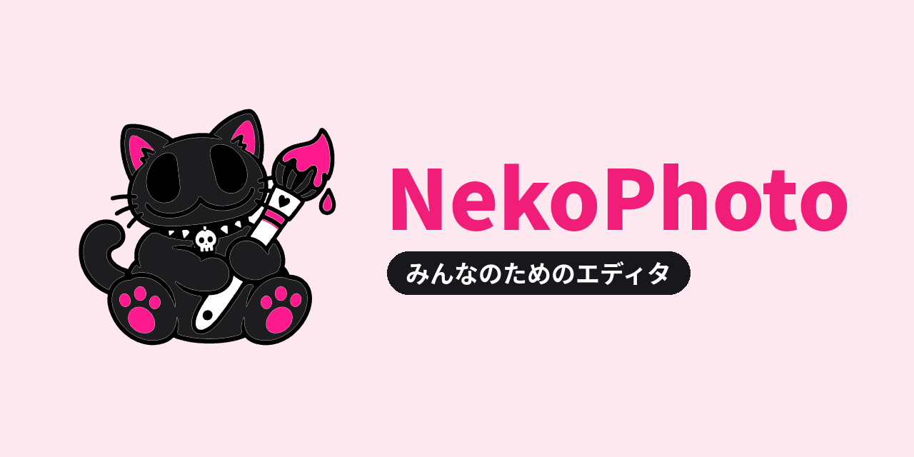
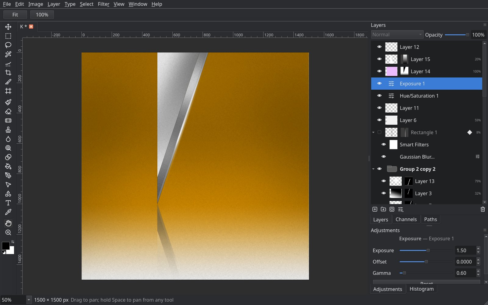
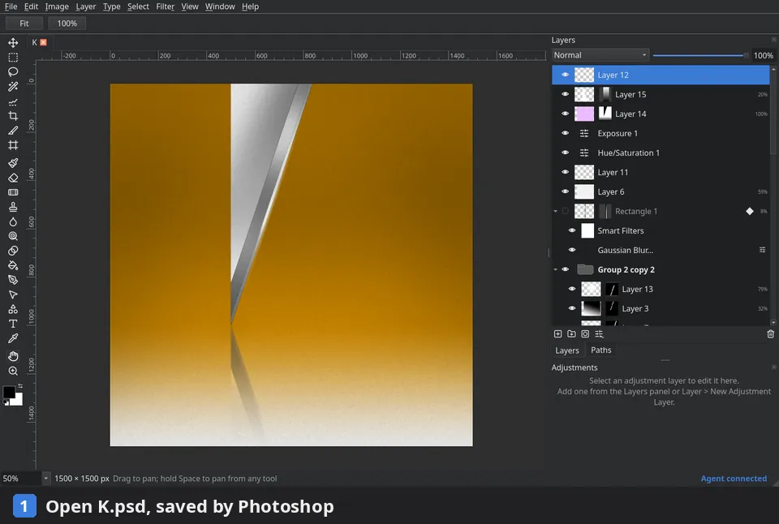
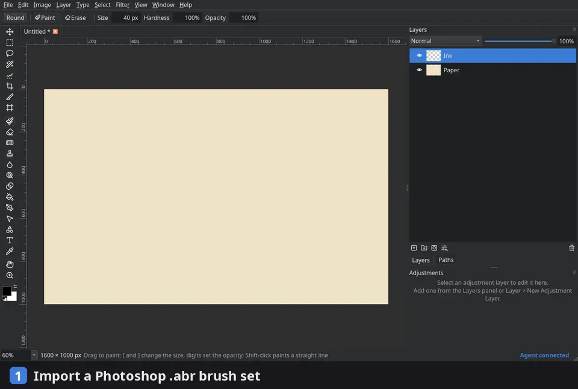
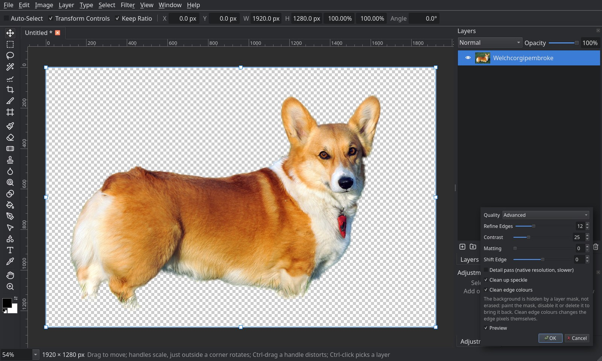
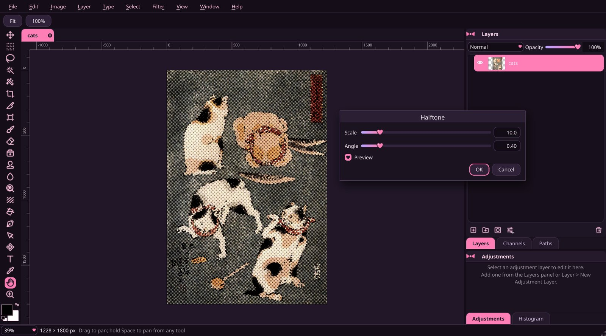

<p align="center">
  
</p>

<p align="center">
  
</p>

<p align="center"><sub>Artwork: <em>K</em> by Nathan Lincoln, used with permission.</sub></p>

# NekoPhoto

**English** · [日本語](#日本語)

**Bring your work with you.** NekoPhoto is a photo editor and painting app for Linux and Windows that opens
your Photoshop and Clip Studio files with their layers, masks and text intact, paints with your Photoshop,
Clip Studio and Procreate brushes, and saves back to layered PSD.

**[Download for Linux (AppImage)](https://github.com/vomitselfie/nekophoto/releases/latest)** ·
**[Download for Windows (portable zip)](https://github.com/vomitselfie/nekophoto/releases/latest)**<br>
Linux: any x86_64 distribution from 2022 on, Wayland or X11. Windows: 10 version 1903 or later, x86_64.

**Your PSDs come back as you sent them.** All 117 PSD and PSB test files in our round-trip corpus (nearly all saved
by Photoshop 2026, covering text, smart objects and Smart Filters, layer styles, shapes, masks and PSB) open, export and
reopen with nothing lost: 3,675 blocks NekoPhoto does not edit go back byte for byte. What PSD cannot carry is
listed before you export. The counts, the known gaps and how to rerun the checks are in
[Compatibility & correctness](docs/compatibility.md).

| Open a PSD, edit, save it as PSD, reopen | Import a Photoshop brush set and paint |
|:---:|:---:|
|  |  |

<sub>Recorded headless from NekoPhoto 1.6.1 over its automation socket. PSD demo artwork: <em>K</em> by Nathan Lincoln,
used with permission (also in the screenshot above). Brush demo: the CC0 “Myer Settlement Brushes” by K. M. Alexander, from Patchy's test fixtures.</sub>

NekoPhoto began as a Linux port of [Compositor](https://github.com/robbietilton/Compositor)
for macOS, and opens its older `.comp` projects. Until version 1.0 it was
called compositor-linux; your settings, brushes and downloaded model move over
by themselves the first time you start it.

## Bring your work with you

NekoPhoto fits into a workflow shared with Photoshop, Krita and Photopea. Layers, masks, selections, brushes,
adjustments and filters work with the tools and shortcuts you know.

| Coming from | Your files | Your brushes and habits |
|---|---|---|
| **Photoshop** | `.psd` and `.psb` open with their layers, folders, masks, clipping masks and blend modes, layer styles, vector shapes, smart objects and editable text, and export back to layered `.psd` with all of it still Photoshop's | `.abr` brushes; the tools and shortcuts you know (V, M, L, W, B, E, `[` `]`, Ctrl+T, Ctrl+J, Ctrl+G) |
| **Clip Studio Paint** | `.clip` projects open with their layers, folders, masks, clipping and blend modes | `.sut` brushes |
| **Procreate** | Your exported images | `.brushset` and `.brush` files |
| **Krita and GIMP** | Photoshop files from collaborators, and your images | The MyPaint brush engine you know, and G'MIC's filters |

PSD export is round-trip tested: every layered PSD we have, from Photoshop and Clip Studio (up to 54
layers in 16 folders at 4096 × 4096), exports and reopens with the same pixels, and the files open in other
PSD readers with their structure intact. What NekoPhoto does not edit yet goes back byte for byte (all 117
files of the round-trip corpus come back unchanged), and layer styles, vector shapes and folders are drawn as
Photoshop draws them, most within a level of its own renders. What PSD cannot carry is listed before you export
([docs/psd-roundtrip.md](docs/psd-roundtrip.md), [docs/psd-export.md](docs/psd-export.md), [docs/compatibility.md](docs/compatibility.md)).

Coming next:

- **Text, shapes and layer styles in CMYK and Lab documents** (everything else already works there)
- **Brushes that feel the same**: a deeper translation of Clip Studio and Photoshop brush settings, so your favourite brush behaves as it did

## What it does

- **Layers:** folders, blend modes, opacity, layer masks, clipping masks, adjustment layers, and Blend If (Layer Style ▸ Blending Options: show or hide a layer by the brightness of its own pixels or of what's beneath, with Alt-split sliders for soft edges)
- **Colour and depth:** 8, 16 and 32 bits per channel. 32-bit HDR documents have HDR Toning, an exposure view, and adjustments, filters, selections and pixel edits that keep light above white. RGB, CMYK and Lab Color documents open from PSD and convert through Image > Mode, colour-managed with ICC profiles. Each mode offers Photoshop's own blend modes and matches its renders. You paint, retouch, adjust, filter, select, crop and transform CMYK and Lab documents in their own colours, never through RGB, and export them to PNG, JPEG, WebP or TIFF. There is a Channels panel, a Histogram panel and a CMYK proof ([docs/bit-depth.md](docs/bit-depth.md), [docs/color-modes.md](docs/color-modes.md))
- **Transform:** move, scale, rotate and distort without losing resolution; Content-Aware Scale and Content-Aware Move
- **Selections:** marquee, lasso, Quick Select by scribble or by click, Content-Aware Fill, and an edge-aware magic wand: shading and texture stay in, edges hold, the tolerance can be changed right after a click, Shift/Alt-clicks add what belongs and what doesn't, and with Contiguous off one click takes a background in many pockets (a baked checkerboard around a character) and Delete leaves the line art without a rim of the background ([docs/smart-wand.md](docs/smart-wand.md))
- **Painting:** brush, eraser, spot healing, clone stamp, smudge, liquify, gradients (Photoshop's Classic, Perceptual and Linear methods), shapes, and text typed straight on the canvas, Japanese input included
- **Brushes:** 196 MyPaint brushes (pencils, inks, charcoal, paint, smudging) that follow pen pressure and tilt, and your own brushes imported from Photoshop (`.abr`), Procreate (`.brushset`, `.brush`) and Clip Studio (`.sut`), or any image as a brush tip
- **Vectors:** Pen and shape tools with path operations, gradient and pattern fills, live rectangles and ellipses, vector masks on any layer, and text to path ([docs/vector-tools.md](docs/vector-tools.md))
- **Artboards and slices,** exported to files in one go ([docs/artboards-slices.md](docs/artboards-slices.md))
- **Actions and Batch:** record steps, play them back, and run them over a folder of files; almost every menu command and the Layers panel's controls are recorded ([docs/actions.md](docs/actions.md))
- **Animation:** a frame Timeline with animated GIF export; GIF and Aseprite files open with their frames ([docs/animation.md](docs/animation.md))
- **Adjustments and filters:** levels, curves, hue/saturation, exposure, gradient map, grain, blurs, noise and lens correction; hold Alt while dragging Levels or Curves to see exactly what clips
- **Remove Background:** an AI model that runs on your own machine; nothing is uploaded
- **G'MIC:** over 850 more filters with a live preview, when `gmic` is installed
- **Files:** Photoshop PSD and PSB, and Clip Studio `.clip` projects, with layers, folders, masks, clipping and blend modes; Photoshop's layer styles, vector shapes and masks drawn as it draws them ([docs/layer-styles.md](docs/layer-styles.md), [docs/vector-masks.md](docs/vector-masks.md)); smart objects you can place, convert, edit and replace without losing resolution ([docs/smart-objects.md](docs/smart-objects.md)); text that stays editable both ways; layered PSD export; projects of up to a gigapixel of layers; camera RAW (opens in Camera Raw first, white balance in Kelvin and Tint, and Open Object keeps the RAW file inside a smart object you can re-develop), Affinity, SVG, PDF, GIF, TGA and ICO; a Photoshop file too big to open can open as its flattened image instead; PNG, JPEG, WebP, TIFF, SVG, GIF, TGA and ICO export; several projects in tabs; crash recovery
- **Works the way Photoshop does:** its tools and shortcuts (Shift+letter steps through a tool group), right-click menus on the canvas that fit the tool and what's under the pointer, rulers and guides with smart guides while you move things, labels you drag to change a number, the Crop tool's ratio presets, and whole layers copied and pasted between documents
- **AI agents:** Claude Code or any MCP client can drive the editor

The full list is in [docs/features.md](docs/features.md).

| Remove Background | G'MIC filters |
|:---:|:---:|
|  |  |

## Performance

The heavy work runs on every core. Times on a 12-core laptop (AMD Ryzen AI 9 HX 370):

| Task | Time |
|---|---|
| Open a 70 MB Photoshop file (17 layers at 4096 × 4096) | 0.7 s |
| Save it as a project | 1.3 s |
| Save a project with five 4096 × 4096 layers | 0.7 s (7.2 s in 0.6.0) |
| Open that project | 0.4 s (2.5 s in 0.6.0) |
| Export a 4096 × 4096 PNG | 0.24 s (1.8 s in 0.6.0) |
| Quick Select, per stroke | 0.16 s on average (0.65 s in 0.6.0) |
| Remove Background on a 10-megapixel photo | 1.7 s (8.3 s with every refinement on) |
| Gaussian blur on a 12-megapixel layer | under 0.1 s |

## Get it

Download the AppImage from the [Releases](../../releases) page, make it
executable, and run it. It works on any x86_64 Linux from 2022 on, under
Wayland or X11.

```bash
chmod +x NekoPhoto-*.AppImage
./NekoPhoto-*.AppImage
```

To add it to your app launcher, open `.comp` projects by double-click and
offer it for `.psd` files, run the integration script once (no root needed;
`--remove` undoes it):

```bash
curl -fsSL https://raw.githubusercontent.com/vomitselfie/nekophoto/main/tools/integrate-appimage.sh | bash -s -- NekoPhoto-*.AppImage
```

**Windows** (10 version 1903 or later, x86_64): download
`NekoPhoto-<version>-windows-x86_64.zip` from the same page, unzip it anywhere
and run `nekophoto.exe`. It is portable: nothing is installed, and settings
live in your user profile. The G'MIC filters need `gmic.exe` on `PATH`.

**Remove Background** is off until you turn it on in Edit > Preferences,
which downloads the model once.

The interface is in English and Japanese: it follows the desktop's language,
and Edit > Preferences > Language picks one (at the next launch).

## Use it with an AI agent

```bash
claude mcp add nekophoto -- uv run /path/to/nekophoto/mcp/nekophoto_mcp.py
```

Then ask for something like "open photo.jpg, remove the background, put a
dark gradient behind it and export result.png". See
[docs/automation.md](docs/automation.md).

## Build from source

```bash
# Arch / Manjaro
sudo pacman -S cmake ninja qt6-base qt6-svg qt6-wayland qt6-imageformats qt6-webengine libpng libmypaint libraw zstd opencv
# Ubuntu 24.04
sudo apt install cmake ninja-build qt6-base-dev qt6-svg-dev qt6-pdf-dev qt6-wayland qt6-image-formats-plugins libpng-dev libmypaint-dev libraw-dev libzstd-dev libsqlite3-dev libgl1-mesa-dev libopencv-dev

cmake -S . -B build -G Ninja -DCMAKE_BUILD_TYPE=Release
cmake --build build -j
./build/src/app/nekophoto
```

Windows builds with MinGW-w64 in MSYS2 (UCRT64); the packages and steps are
in [docs/linux-port.md](docs/linux-port.md#windows), as are build options,
command-line flags and keyboard shortcuts.

## Contributing

Building, the code's layout, the rules a change has to follow and how CI checks a pull request are in
[CONTRIBUTING.md](CONTRIBUTING.md). Report security problems privately as [SECURITY.md](SECURITY.md) describes.
What is tested and what still differs from Photoshop: [docs/compatibility.md](docs/compatibility.md).

## License

GPL-3.0-or-later; see [LICENSE](LICENSE). Based on Compositor by Wonder
Assembly LLC, whose code keeps its MIT licence
([LICENSES/MIT-Compositor.txt](LICENSES/MIT-Compositor.txt)). Third-party
components and their licences are listed in
[THIRD-PARTY-NOTICES.md](THIRD-PARTY-NOTICES.md).

---

## 日本語

[English](#nekophoto) · **日本語**

**作品をそのまま持ってこられます。** NekoPhoto は Linux・Windows 向けの写真編集・お絵描きソフトです。
Photoshop とクリップスタジオのファイルをレイヤー・マスク・テキストを保ったまま開け、Photoshop・クリップスタジオ・Procreate
のブラシで描け、レイヤー付きの PSD に保存し直せます。

**[Linux 版をダウンロード(AppImage)](https://github.com/vomitselfie/nekophoto/releases/latest)** ·
**[Windows 版をダウンロード(ポータブル zip)](https://github.com/vomitselfie/nekophoto/releases/latest)**<br>
Linux: 2022 年以降の x86_64 ディストリビューション(Wayland・X11)。Windows: 10 バージョン 1903 以降(x86_64)。

**PSD は送ったときのまま戻ってきます。** 往復テスト用の PSD・PSB ファイル 117 個(ほぼすべて Photoshop 2026 で保存。
テキスト、スマートオブジェクトとスマートフィルター、レイヤースタイル、シェイプ、マスク、PSB を網羅)は、開いて書き出し、
開き直しても何も失われません。NekoPhoto が編集しない 3,675 個のブロックはバイト単位でそのまま戻ります。PSD で表現できない
要素は書き出す前に一覧表示されます。集計値・既知の差異・検証の再実行方法は
[互換性と正確さ](docs/compatibility.md#日本語)にまとめています。

| PSD を開いて編集し、PSD に保存して開き直す | Photoshop のブラシセットを読み込んで描く |
|:---:|:---:|
|  |  |

<sub>NekoPhoto 1.6.1 を画面なしで起動し、自動操作ソケット経由で記録しました。冒頭の画像と PSD のデモの作品: Nathan Lincoln
『K』(許可を得て使用)。ブラシのデモ: K. M. Alexander による CC0 の「Myer Settlement Brushes」(Patchy のテスト用ファイルより)。</sub>

NekoPhoto は macOS 版 [Compositor](https://github.com/robbietilton/Compositor) の
Linux 移植として始まり、Mac 版の以前の `.comp` プロジェクトも開けます。バージョン 1.0 までは
compositor-linux という名前でした。設定・ブラシ・ダウンロード済みのモデルは、初回起動時に自動で引き継がれます。

### 作品をそのまま持ってくる

Photoshop・Krita・Photopea を使う人とのやり取りにもそのまま組み込めます。レイヤー、マスク、選択範囲、ブラシ、
色調補正、フィルターを、おなじみのツールとショートカットで操作できます。

| 移行元 | ファイル | ブラシと操作 |
|---|---|---|
| **Photoshop** | `.psd`・`.psb` をレイヤー・グループ・マスク・クリッピングマスク・描画モード・レイヤースタイル・ベクターシェイプ・スマートオブジェクト・編集可能なテキストを保ったまま開け、それらを Photoshop のまま保ってレイヤー付きの `.psd` に書き出せます | `.abr` ブラシ、おなじみのツールとショートカット(V、M、L、W、B、E、`[` `]`、Ctrl+T、Ctrl+J、Ctrl+G) |
| **クリップスタジオ** | `.clip` をレイヤー・フォルダー・マスク・クリッピング・描画モードを保ったまま開けます | `.sut` ブラシ |
| **Procreate** | 書き出した画像 | `.brushset`・`.brush` |
| **Krita・GIMP** | 共同作業者から届いた Photoshop ファイルや画像 | おなじみの MyPaint ブラシエンジンと G'MIC フィルター |

PSD の書き出しは往復テスト済みです。手元にあるレイヤー付き PSD(Photoshop とクリップスタジオ製、4096 × 4096 で最大 54 レイヤー・16 グループ)は、
書き出して開き直してもピクセル単位で同じになり、ほかの PSD リーダーでも構造を保ったまま開けます。NekoPhoto がまだ編集できない要素はバイト単位でそのまま戻り(往復テスト用のファイル 117 個すべてが変化なく戻ります)、レイヤースタイル・ベクターシェイプ・グループは Photoshop と同じように描画されます。PSD で表現できない要素は書き出す前に一覧表示されます
([docs/psd-export.md](docs/psd-export.md)、英語)。

今後の予定:

- **CMYK・Lab ドキュメントでのテキスト・シェイプ・レイヤースタイル**(それ以外はすでに使えます)
- **同じ描き心地のブラシ**: クリップスタジオや Photoshop のブラシ設定をより深く変換し、お気に入りのブラシがそのままの感覚で使えるように

### できること

- **レイヤー:** グループ、描画モード、不透明度、レイヤーマスク、クリッピングマスク、調整レイヤー、ブレンド条件(レイヤースタイル ▸ レイヤー効果の詳細:自分や下のレイヤーの明るさでピクセルを表示・非表示。Alt で分割したスライダーで境界をなめらかに)
- **色とビット数:** 8・16・32 ビット/チャンネル。32 ビットの HDR ドキュメントでは HDR トーン、露光量を変えられる表示、白より明るい光を保ったままの色調補正・フィルター・選択範囲・ピクセル編集が使えます。RGB・CMYK・Lab カラーのドキュメントを PSD から開き、イメージ > モードで変換でき、ICC プロファイルでカラーマネジメントされます。どのモードでも Photoshop と同じ描画モードが使え、Photoshop の描画結果と一致します。CMYK・Lab のドキュメントは RGB を経由せずそのままの色で描画・修正・色調補正・フィルター・選択・切り抜き・変形ができ、PNG・JPEG・WebP・TIFF に書き出せます。チャンネルパネル、ヒストグラムパネル、CMYK の校正表示もあります
- **変形:** 解像度を落とさずに移動・拡大縮小・回転・自由変形。コンテンツに応じて拡大・縮小、コンテンツに応じた移動
- **選択範囲:** 長方形・楕円選択、なげなわ、なぞる/クリックするだけのクイック選択、コンテンツに応じた塗りつぶし、そして輪郭を読み取る自動選択(陰影やテクスチャは含め、境界では止まります。クリック直後に許容値を変えて調整でき、Shift/Alt クリックで含めるもの・除くものを指示できます。「隣接」をオフにすれば、キャラクターの周りに分かれた背景も 1 クリックで選択でき、削除しても線画に背景の色が残りません)
- **描画:** ブラシ、消しゴム、スポット修復ブラシ、コピースタンプ、指先ツール、ゆがみ、グラデーション(Photoshop と同じクラシック・知覚的・リニアの方式)、シェイプ、キャンバスに直接入力できるテキスト(日本語入力にも対応)
- **ブラシ:** 筆圧と傾きに反応する MyPaint ブラシ 196 種類(鉛筆、インク、木炭、絵の具、ぼかし)。Photoshop(`.abr`)、Procreate(`.brushset`・`.brush`)、クリップスタジオ(`.sut`)のブラシや、任意の画像をブラシ先端として読み込めます
- **ベクター:** パスの結合・型抜きができるペンとシェイプ、グラデーション・パターンの塗り、ライブシェイプ、あらゆるレイヤーのベクターマスク、テキストのパス化
- **アートボードとスライス:** まとめてファイルに書き出せます
- **アクションとバッチ:** 操作を記録・再生し、フォルダー内のファイルに一括適用できます。ほとんどのメニューコマンドとレイヤーパネルの操作が記録されます
- **アニメーション:** フレームタイムラインとアニメーション GIF の書き出し。GIF・Aseprite ファイルはフレームごと開けます
- **色調補正とフィルター:** レベル補正、トーンカーブ、色相・彩度、露光量、グラデーションマップ、粒子、ぼかし、ノイズ、レンズ補正。レベル補正やトーンカーブで Alt を押しながらドラッグすると、白飛び・黒つぶれする部分が表示されます
- **背景を削除:** AI モデルは手元のマシンで動作し、画像はどこにも送信されません
- **G'MIC:** `gmic` をインストールすると、850 種類以上のフィルターをライブプレビュー付きで使えます
- **ファイル:** レイヤー・フォルダー・マスク・クリッピング・描画モードを保ったまま PSD/PSB とクリップスタジオの `.clip` を開け、レイヤー付き PSD に書き出せます。1 ギガピクセルまでのプロジェクト、カメラ RAW(まず Camera Raw で開き、ホワイトバランスは色温度と色かぶり補正。「オブジェクトとして開く」なら RAW を含むスマートオブジェクトとして後から現像し直せます)・Affinity・SVG・PDF・GIF・TGA・ICO の読み込み、大きすぎて開けない Photoshop ファイルは統合画像として開くこともできます、PNG・JPEG・WebP・TIFF・SVG・GIF・TGA・ICO 書き出し、タブで複数のプロジェクト、クラッシュからの復元
- **Photoshop と同じ操作感:** おなじみのツールとショートカット(Shift+キーでツールグループを切り替え)、ツールとポインター下の対象に合わせたカンバスの右クリックメニュー、定規・ガイドと移動中のスマートガイド、ラベルをドラッグして数値を変更、切り抜きツールの比率プリセット、ドキュメント間でのレイヤーのコピー&ペースト
- **AI エージェント:** Claude Code などの MCP クライアントから操作できます

機能の一覧は [docs/features.md](docs/features.md#日本語) にあります。

| 背景を削除 | G'MIC フィルター |
|:---:|:---:|
|  |  |

### パフォーマンス

重い処理はすべての CPU コアで並列に実行します。12 コアのノート PC(AMD Ryzen AI 9 HX 370)での計測値:

| 処理 | 時間 |
|---|---|
| 70 MB の Photoshop ファイルを開く(4096 × 4096 のレイヤー 17 枚) | 0.7 秒 |
| それをプロジェクトとして保存 | 1.3 秒 |
| 4096 × 4096 のレイヤー 5 枚のプロジェクトを保存 | 0.7 秒(0.6.0 では 7.2 秒) |
| そのプロジェクトを開く | 0.4 秒(0.6.0 では 2.5 秒) |
| 4096 × 4096 の PNG を書き出し | 0.24 秒(0.6.0 では 1.8 秒) |
| クイック選択(1 ストロークあたり) | 平均 0.16 秒(0.6.0 では 0.65 秒) |
| 1000 万画素の写真の背景を削除 | 1.7 秒(すべての補正をオンにして 8.3 秒) |
| 1200 万画素のレイヤーにぼかし(ガウス) | 0.1 秒未満 |

### 入手方法

[Releases](../../releases) ページから AppImage をダウンロードし、実行権限を付けて起動します。
2022 年以降の x86_64 Linux であれば、Wayland と X11 のどちらでも動作します。

```bash
chmod +x NekoPhoto-*.AppImage
./NekoPhoto-*.AppImage
```

アプリランチャーに登録し、`.comp` をダブルクリックで開けるようにして `.psd` の「別のアプリで開く」にも
表示させるには、統合スクリプトを一度実行します(root 権限は不要、`--remove` で元に戻せます):

```bash
curl -fsSL https://raw.githubusercontent.com/vomitselfie/nekophoto/main/tools/integrate-appimage.sh | bash -s -- NekoPhoto-*.AppImage
```

**Windows**(10 バージョン 1903 以降、x86_64)では、同じページから `NekoPhoto-<version>-windows-x86_64.zip`
をダウンロードし、好きな場所に展開して `nekophoto.exe` を起動します。インストール不要のポータブル版で、
設定はユーザープロファイルに保存されます。G'MIC フィルターを使うには `gmic.exe` に PATH を通してください。

**背景を削除** は、編集 > 環境設定 でオンにすると使えるようになります(モデルを一度だけダウンロードします)。

画面表示は日本語と英語に対応しています。デスクトップの言語に合わせて切り替わり、編集 > 環境設定 > 言語 で
選ぶこともできます(次回の起動から反映されます)。

### AI エージェントから使う

```bash
claude mcp add nekophoto -- uv run /path/to/nekophoto/mcp/nekophoto_mcp.py
```

あとは「photo.jpg を開いて背景を削除し、後ろに暗いグラデーションを敷いて result.png に書き出して」
のように頼むだけです。詳しくは [docs/automation.md](docs/automation.md)(英語)をご覧ください。

### ソースからビルド

必要なパッケージとビルド手順は、英語版の [Build from source](#build-from-source) と同じです。
Windows では MSYS2(UCRT64)の MinGW-w64 でビルドします。手順とビルドオプション、キーボードショートカットは
[docs/linux-port.md](docs/linux-port.md)(英語)にあります。

### 開発に参加する

ビルド方法、コードの構成、変更が守るべきルール、プルリクエストで CI が確認する内容は [CONTRIBUTING.md](CONTRIBUTING.md)(英語)に、
セキュリティ上の問題の非公開での報告方法は [SECURITY.md](SECURITY.md)(英語)にあります。テストの内容と Photoshop との既知の差異は
[docs/compatibility.md](docs/compatibility.md#日本語) をご覧ください。

### ライセンス

GPL-3.0-or-later です([LICENSE](LICENSE))。Wonder Assembly LLC の Compositor を元にしており、
その部分のコードは MIT ライセンスのままです([LICENSES/MIT-Compositor.txt](LICENSES/MIT-Compositor.txt))。
サードパーティー製コンポーネントとそのライセンスは [THIRD-PARTY-NOTICES.md](THIRD-PARTY-NOTICES.md) にまとめています。
